### Part 2: Linear Data Structures, Hashing & the Swift Collections Framework

> This continues from **Part 1 (Searching & Sorting)**. Here we cover how data is *organized* — arrays, linked lists, stacks, queues, hash-based structures, and Apple's official `swift-collections` package.

---

## 1. Linear Data Structures

A **linear data structure** arranges elements sequentially, where each element connects to the one before and after it (except the ends).

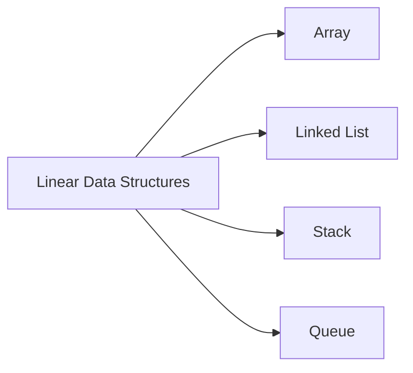

---

### 1.1 Array

A contiguous block of memory holding elements of the same type, accessed by index.

- **Access:** O(1)
- **Search:** O(n)
- **Insert/Delete at end:** O(1) amortized
- **Insert/Delete at start/middle:** O(n) — requires shifting elements

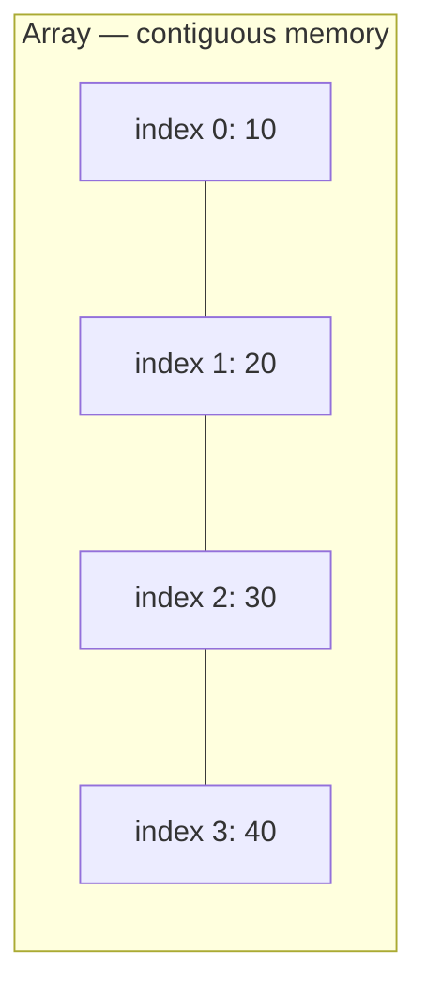

```swift
var numbers: [Int] = [10, 20, 30, 40]

numbers.append(50)          // [10, 20, 30, 40, 50] — O(1) amortized
numbers.insert(5, at: 0)    // [5, 10, 20, 30, 40, 50] — O(n), shifts everything right
numbers.remove(at: 2)       // removes element at index 2 — O(n)
let value = numbers[1]      // O(1) direct access

print(numbers)
```

**Swift arrays are value types** with copy-on-write — assigning or passing an array only copies the underlying buffer the moment it's mutated, which keeps everyday usage efficient.

---

### 1.2 Linked List

A sequence of **nodes**, where each node stores a value and a reference (pointer) to the next node. Unlike arrays, elements aren't stored contiguously in memory.

- **Access:** O(n)
- **Search:** O(n)
- **Insert/Delete at head:** O(1)
- **Insert/Delete at tail:** O(1) with tail pointer, else O(n)

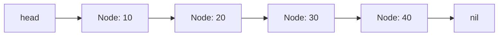

```swift
final class Node<T> {
    var value: T
    var next: Node<T>?
    init(_ value: T) { self.value = value }
}

final class LinkedList<T> {
    private var head: Node<T>?
    private var tail: Node<T>?

    var isEmpty: Bool { head == nil }

    // Add to the end — O(1) thanks to tail pointer
    func append(_ value: T) {
        let newNode = Node(value)
        if let tailNode = tail {
            tailNode.next = newNode
        } else {
            head = newNode
        }
        tail = newNode
    }

    // Add to the front — O(1)
    func prepend(_ value: T) {
        let newNode = Node(value)
        newNode.next = head
        head = newNode
        if tail == nil { tail = newNode }
    }

    // Remove the first node matching a value — O(n)
    func remove(_ value: T) where T: Equatable {
        guard let headNode = head else { return }

        if headNode.value == value {
            head = headNode.next
            if head == nil { tail = nil }
            return
        }

        var current = headNode
        while let next = current.next {
            if next.value == value {
                current.next = next.next
                if next === tail { tail = current }
                return
            }
            current = next
        }
    }

    func printList() {
        var current = head
        var result: [String] = []
        while let node = current {
            result.append("\(node.value)")
            current = node.next
        }
        print(result.joined(separator: " -> "))
    }
}

// Example usage
let list = LinkedList<Int>()
list.append(10)
list.append(20)
list.append(30)
list.prepend(5)
list.printList()   // 5 -> 10 -> 20 -> 30
list.remove(20)
list.printList()   // 5 -> 10 -> 30
```

**Array vs Linked List**

| | Array | Linked List |
|---|---|---|
| Memory layout | Contiguous | Scattered (nodes + pointers) |
| Random access | O(1) | O(n) |
| Insert/delete at start | O(n) | O(1) |
| Cache performance | Better (locality) | Worse |
| Extra memory per element | None | Pointer overhead |

---

### 1.3 Stack (LIFO — Last In, First Out)

Think of a stack of plates — you add and remove from the **top only**.

- **Push, Pop, Peek:** all O(1)
- **Use cases:** undo/redo, function call stack, expression parsing, navigation history (back button)

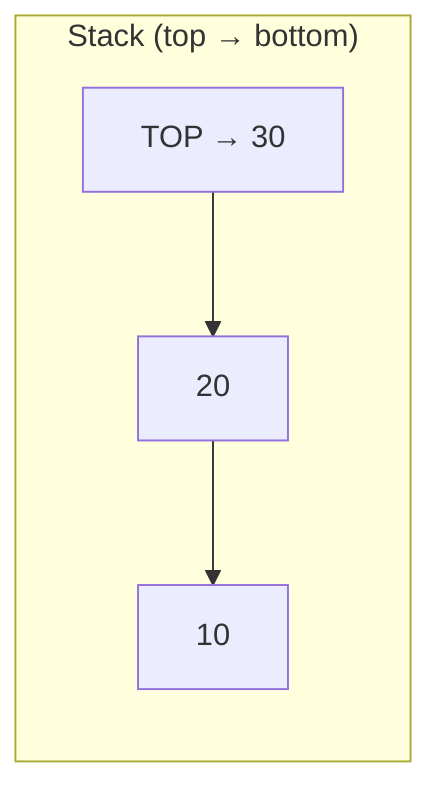

```swift
struct Stack<T> {
    private var items: [T] = []

    var isEmpty: Bool { items.isEmpty }
    var count: Int { items.count }
    var peek: T? { items.last }

    mutating func push(_ item: T) {
        items.append(item)
    }

    @discardableResult
    mutating func pop() -> T? {
        items.popLast()
    }
}

// Example usage
var stack = Stack<Int>()
stack.push(10)
stack.push(20)
stack.push(30)
print(stack.peek ?? "empty")   // 30
stack.pop()
print(stack.peek ?? "empty")   // 20
```

---

### 1.4 Queue (FIFO — First In, First Out)

Like a checkout line — first person in line is served first.

- **Enqueue, Dequeue:** O(1) with the right underlying structure
- **Use cases:** task scheduling, printer queues, breadth-first search (BFS), message queues

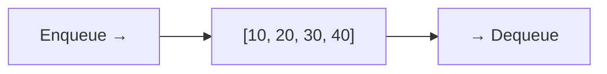

A naive array-backed queue makes `dequeue()` O(n) (because everything shifts left after removing index 0). A **two-index / ring buffer** or **two-stack** approach keeps it efficient:

```swift
struct Queue<T> {
    private var enqueueStack: [T] = []
    private var dequeueStack: [T] = []

    var isEmpty: Bool { enqueueStack.isEmpty && dequeueStack.isEmpty }

    mutating func enqueue(_ item: T) {
        enqueueStack.append(item)      // O(1)
    }

    mutating func dequeue() -> T? {
        if dequeueStack.isEmpty {
            dequeueStack = enqueueStack.reversed()
            enqueueStack.removeAll()
        }
        return dequeueStack.popLast()  // amortized O(1)
    }
}

// Example usage
var queue = Queue<String>()
queue.enqueue("A")
queue.enqueue("B")
queue.enqueue("C")
print(queue.dequeue() ?? "")   // A
print(queue.dequeue() ?? "")   // B
```

**Stack vs Queue**

| | Stack | Queue |
|---|---|---|
| Order | LIFO | FIFO |
| Add | push (top) | enqueue (rear) |
| Remove | pop (top) | dequeue (front) |
| Real-world analogy | Stack of plates | Checkout line |

---

## 2. Hashing

**Hashing** maps a key to an index in an array (a "bucket") using a **hash function**, giving near-instant lookups.

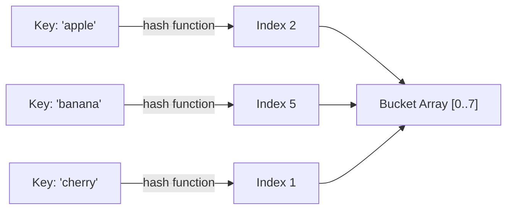

- **Average case:** O(1) for insert, delete, search
- **Worst case:** O(n) — when many keys hash to the same bucket (collisions)

### 2.1 Collisions & Resolution

Two different keys can produce the same hash index. Common resolution strategies:

| Strategy | How it works |
|---|---|
| **Chaining** | Each bucket holds a linked list (or array) of all colliding entries |
| **Open Addressing** | On collision, probe for the next free slot (linear/quadratic probing, double hashing) |

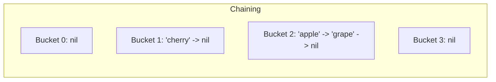

### 2.2 Swift's Dictionary and Set

Swift's `Dictionary` and `Set` are hash-table-backed collections — this is hashing in daily practice.

```swift
// Dictionary: key-value hashing — O(1) average lookup
var ageOfPerson: [String: Int] = ["Alice": 30, "Bob": 25]
ageOfPerson["Charlie"] = 35              // insert — O(1) average
print(ageOfPerson["Alice"] ?? 0)          // lookup — O(1) average
ageOfPerson.removeValue(forKey: "Bob")    // delete — O(1) average

// Set: hashing used to guarantee uniqueness + O(1) membership check
var uniqueNumbers: Set<Int> = [1, 2, 3, 2, 1]
print(uniqueNumbers)                      // [1, 2, 3] — duplicates removed
print(uniqueNumbers.contains(2))          // O(1) average — true
```

For custom types to be used as Dictionary keys or Set elements, they must conform to `Hashable`:

```swift
struct Point: Hashable {
    let x: Int
    let y: Int
}

var visited: Set<Point> = []
visited.insert(Point(x: 1, y: 2))
print(visited.contains(Point(x: 1, y: 2)))   // true
```

### 2.3 Building a Simple Hash Table from Scratch

Useful for interviews and understanding what `Dictionary` does under the hood.

```swift
struct SimpleHashTable<Key: Hashable, Value> {
    private var buckets: [[(key: Key, value: Value)]]
    private let capacity: Int

    init(capacity: Int = 16) {
        self.capacity = capacity
        self.buckets = Array(repeating: [], count: capacity)
    }

    private func index(for key: Key) -> Int {
        abs(key.hashValue) % capacity
    }

    mutating func set(_ key: Key, _ value: Value) {
        let idx = index(for: key)
        if let pos = buckets[idx].firstIndex(where: { $0.key == key }) {
            buckets[idx][pos].value = value        // update existing
        } else {
            buckets[idx].append((key, value))       // chaining: append to bucket
        }
    }

    func get(_ key: Key) -> Value? {
        let idx = index(for: key)
        return buckets[idx].first(where: { $0.key == key })?.value
    }

    mutating func remove(_ key: Key) {
        let idx = index(for: key)
        buckets[idx].removeAll { $0.key == key }
    }
}

// Example usage
var table = SimpleHashTable<String, Int>()
table.set("apple", 10)
table.set("banana", 20)
print(table.get("apple") ?? -1)   // 10
table.remove("apple")
print(table.get("apple") ?? -1)   // -1
```

### 2.4 Common Hashing Use Cases

| Use Case | Why Hashing Helps |
|---|---|
| Caching | O(1) lookup of cached results by key |
| Deduplication | `Set` removes duplicates in O(n) total |
| Counting frequencies | Word/character counts via `[Character: Int]` |
| Two Sum problem | Store complements in a dictionary for O(n) instead of O(n²) |
| Grouping | Group anagrams, group by category, etc. |

**Two Sum example — classic interview problem solved with hashing:**

```swift
func twoSum(_ nums: [Int], _ target: Int) -> [Int]? {
    var seen: [Int: Int] = [:]   // value -> index

    for (i, num) in nums.enumerated() {
        let complement = target - num
        if let j = seen[complement] {
            return [j, i]
        }
        seen[num] = i
    }
    return nil
}

print(twoSum([2, 7, 11, 15], 9) ?? [])   // [0, 1] — O(n) instead of O(n²)
```

---

## 3. Swift Collections Framework

Apple's open-source [`swift-collections`](https://github.com/apple/swift-collections) package extends the standard library with production-ready structures the standard library doesn't include out of the box.

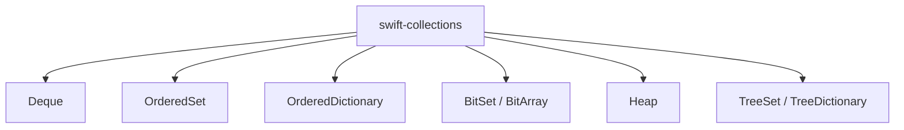

Add it via Swift Package Manager:

```swift
// Package.swift
dependencies: [
    .package(url: "https://github.com/apple/swift-collections.git", from: "1.1.0")
]
```

### 3.1 `Deque` — Double-Ended Queue

Efficient insertion/removal at **both ends** — O(1) amortized, unlike `Array` which is O(n) at the front.

```swift
import DequeModule

var deque: Deque<Int> = [10, 20, 30]

deque.append(40)          // [10, 20, 30, 40] — O(1)
deque.prepend(5)          // [5, 10, 20, 30, 40] — O(1), unlike Array.insert(at: 0)
deque.removeFirst()       // O(1)
deque.removeLast()        // O(1)

print(deque)
```

**Great for:** sliding window algorithms, BFS, undo/redo with both-end access, task scheduling.

### 3.2 `OrderedSet`

Combines `Set`'s uniqueness guarantee with `Array`'s ordering and index-based access.

```swift
import OrderedCollections

var orderedSet: OrderedSet<String> = ["apple", "banana", "cherry"]

orderedSet.append("apple")     // no-op — already present, order preserved
orderedSet.append("date")      // ["apple", "banana", "cherry", "date"]

print(orderedSet[1])            // "banana" — O(1) indexed access
print(orderedSet.contains("banana"))   // O(1) average lookup
```

**Great for:** maintaining insertion order while guaranteeing no duplicates — e.g. recently-viewed items, unique tag lists.

### 3.3 `OrderedDictionary`

Like `Dictionary`, but remembers insertion order — standard `Dictionary` order is unspecified.

```swift
import OrderedCollections

var orderedDict: OrderedDictionary<String, Int> = [:]
orderedDict["z"] = 1
orderedDict["a"] = 2
orderedDict["m"] = 3

for (key, value) in orderedDict {
    print("\(key): \(value)")
}
// Prints in insertion order: z: 1, a: 2, m: 3
// A plain Dictionary would NOT guarantee this order
```

### 3.4 `Heap` (Priority Queue)

A binary heap giving O(log n) insertion and O(1) access to the min/max element. Ideal for priority queues, scheduling, and "top-K" problems.

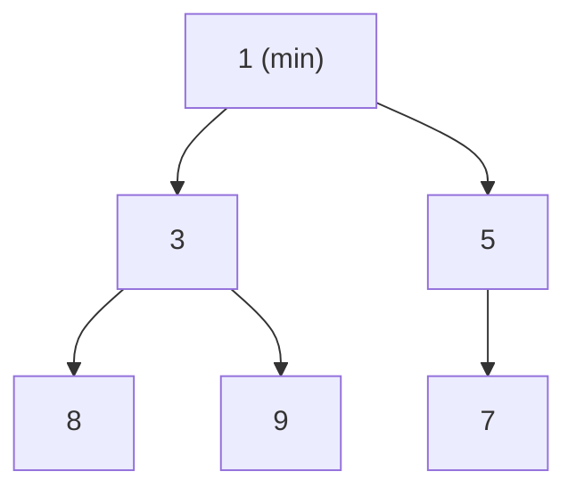

```swift
import HeapModule

var minHeap = Heap<Int>()
minHeap.insert(5)
minHeap.insert(1)
minHeap.insert(8)
minHeap.insert(3)

print(minHeap.min ?? -1)     // 1 — O(1) peek
print(minHeap.popMin() ?? -1) // 1 — O(log n) remove
print(minHeap.popMin() ?? -1) // 3
```

**Great for:** task schedulers, Dijkstra's algorithm, "K largest/smallest elements", event simulation.

### 3.5 Choosing the Right Collection

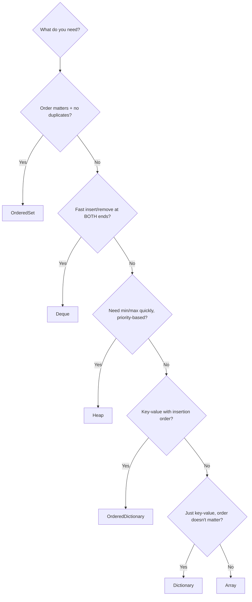

| Structure | Package | Ordered? | Unique? | Best For |
|---|---|---|---|---|
| `Array` | Standard Library | ✅ | ❌ | General sequential storage |
| `Set` | Standard Library | ❌ | ✅ | Fast membership checks |
| `Dictionary` | Standard Library | ❌ | ✅ (keys) | Key-value lookups |
| `Deque` | swift-collections | ✅ | ❌ | Both-end insert/remove |
| `OrderedSet` | swift-collections | ✅ | ✅ | Unique + order preserved |
| `OrderedDictionary` | swift-collections | ✅ | ✅ (keys) | Key-value + order preserved |
| `Heap` | swift-collections | Priority-based | ❌ | Priority queues, top-K |

---

## 4. Recap

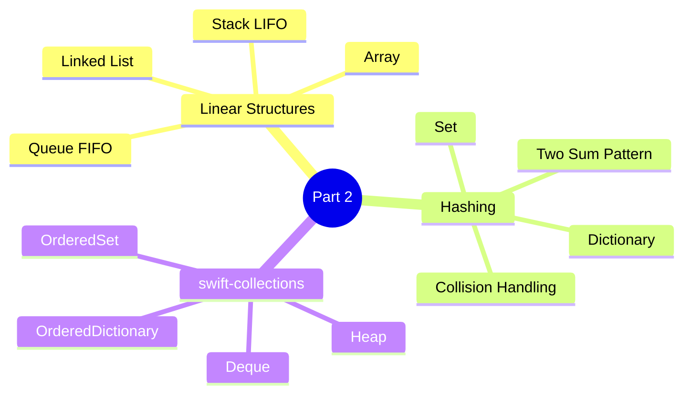
