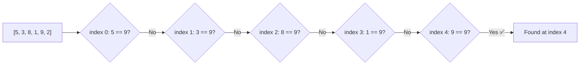
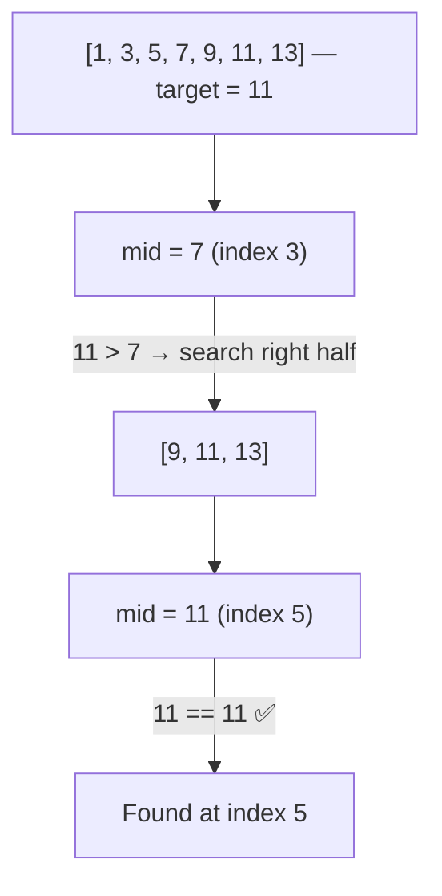
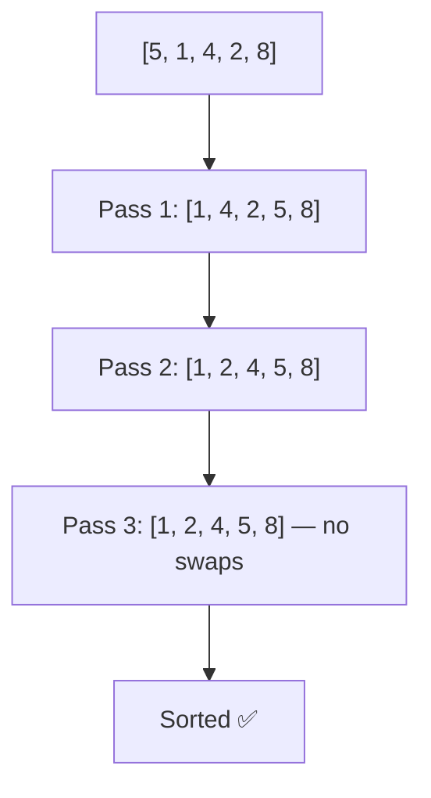
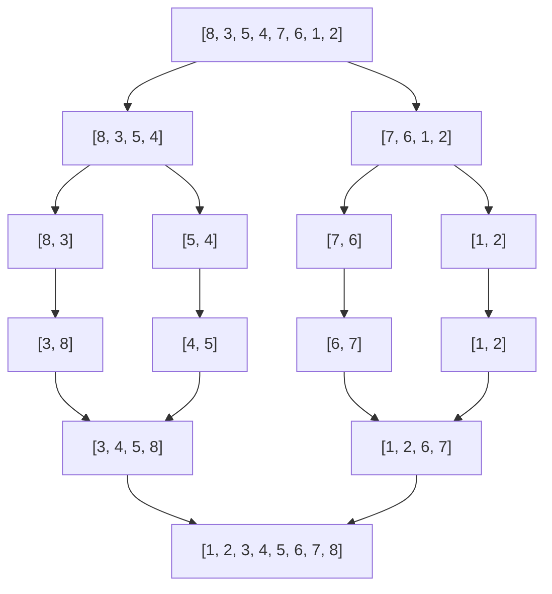
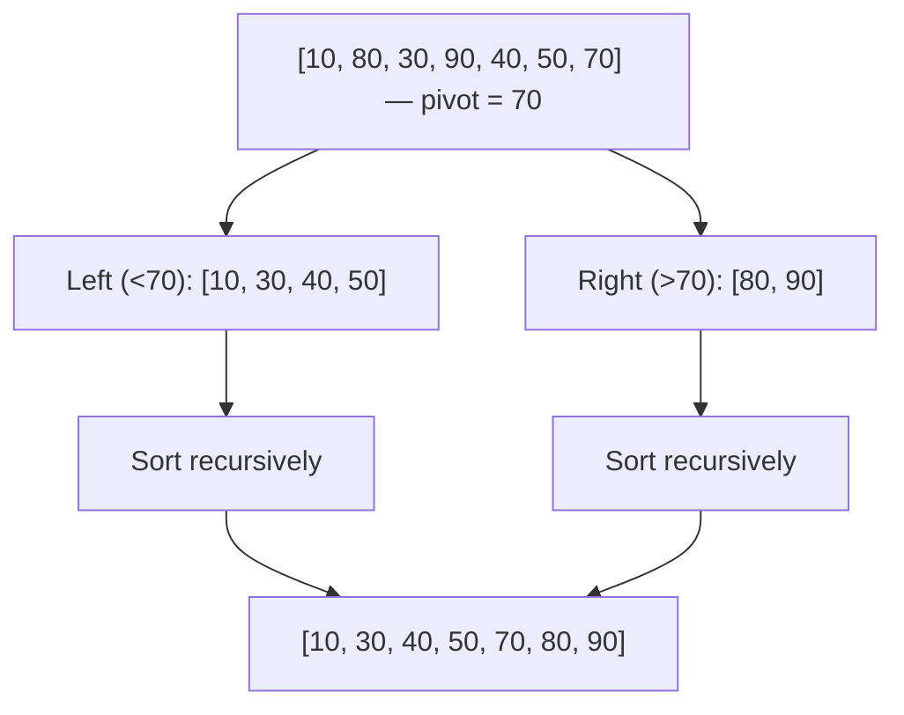
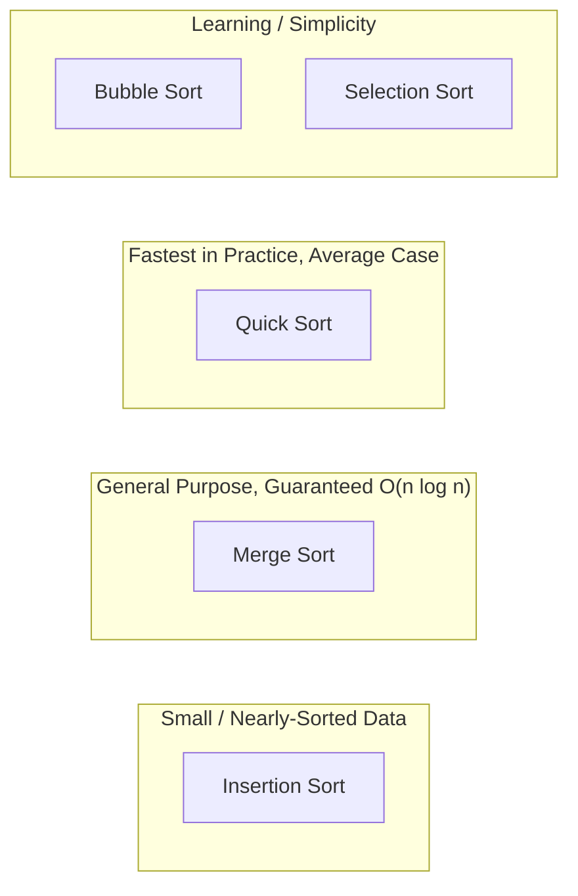

> 📌 In this document, we'll focus on **Searching** and **Sorting** — the foundation every other algorithm builds on.
---

## 5. Searching Algorithms

### 5.1 Linear Search

Checks every element one by one until a match is found. Works on **unsorted** data.

- **Time Complexity:** O(n)
- **Space Complexity:** O(1)



```swift
func linearSearch<T: Equatable>(_ array: [T], target: T) -> Int? {
    for (index, element) in array.enumerated() {
        if element == target {
            return index
        }
    }
    return nil
}

// Example usage
let numbers = [5, 3, 8, 1, 9, 2]
if let index = linearSearch(numbers, target: 9) {
    print("Found 9 at index \(index)")
} else {
    print("Not found")
}
// Output: Found 9 at index 4
```

---

### 5.2 Binary Search

Repeatedly divides a **sorted** array in half, discarding the half that cannot contain the target.

- **Time Complexity:** O(log n)
- **Space Complexity:** O(1) iterative / O(log n) recursive
- **Precondition:** Array must be sorted.



```swift
func binarySearch<T: Comparable>(_ array: [T], target: T) -> Int? {
    var low = 0
    var high = array.count - 1

    while low <= high {
        let mid = low + (high - low) / 2   // avoids overflow
        if array[mid] == target {
            return mid
        } else if array[mid] < target {
            low = mid + 1
        } else {
            high = mid - 1
        }
    }
    return nil
}

// Example usage — array MUST be sorted
let sortedNumbers = [1, 3, 5, 7, 9, 11, 13]
if let index = binarySearch(sortedNumbers, target: 11) {
    print("Found 11 at index \(index)")
}
// Output: Found 11 at index 5
```

**Recursive version:**

```swift
func binarySearchRecursive<T: Comparable>(_ array: [T], target: T, low: Int, high: Int) -> Int? {
    guard low <= high else { return nil }

    let mid = low + (high - low) / 2
    if array[mid] == target {
        return mid
    } else if array[mid] < target {
        return binarySearchRecursive(array, target: target, low: mid + 1, high: high)
    } else {
        return binarySearchRecursive(array, target: target, low: low, high: mid - 1)
    }
}
```

### Linear vs Binary Search

| | Linear Search | Binary Search |
|---|---|---|
| Data requirement | Unsorted or sorted | Must be sorted |
| Time complexity | O(n) | O(log n) |
| Approach | Sequential | Divide and conquer |
| Best for | Small/unsorted datasets | Large sorted datasets |

---

## 6. Sorting Algorithms

### 6.1 Bubble Sort

Repeatedly swaps adjacent elements if they're in the wrong order, "bubbling" the largest value to the end each pass.

- **Time Complexity:** O(n²) average/worst, O(n) best (already sorted)
- **Space Complexity:** O(1)
- **Stable:** Yes



```swift
func bubbleSort<T: Comparable>(_ array: [T]) -> [T] {
    var arr = array
    let n = arr.count

    for i in 0..<n {
        var swapped = false
        for j in 0..<(n - i - 1) {
            if arr[j] > arr[j + 1] {
                arr.swapAt(j, j + 1)
                swapped = true
            }
        }
        if !swapped { break }   // already sorted, stop early
    }
    return arr
}

// Example usage
print(bubbleSort([5, 1, 4, 2, 8]))
// Output: [1, 2, 4, 5, 8]
```

---

### 6.2 Selection Sort

Finds the minimum element from the unsorted part and places it at the beginning.

- **Time Complexity:** O(n²)
- **Space Complexity:** O(1)
- **Stable:** No

```swift
func selectionSort<T: Comparable>(_ array: [T]) -> [T] {
    var arr = array
    let n = arr.count

    for i in 0..<n {
        var minIndex = i
        for j in (i + 1)..<n {
            if arr[j] < arr[minIndex] {
                minIndex = j
            }
        }
        if minIndex != i {
            arr.swapAt(i, minIndex)
        }
    }
    return arr
}

// Example usage
print(selectionSort([64, 25, 12, 22, 11]))
// Output: [11, 12, 22, 25, 64]
```

---

### 6.3 Insertion Sort

Builds the sorted array one element at a time by inserting each new element into its correct position — like sorting playing cards in your hand.

- **Time Complexity:** O(n²) average/worst, O(n) best
- **Space Complexity:** O(1)
- **Stable:** Yes

```swift
func insertionSort<T: Comparable>(_ array: [T]) -> [T] {
    var arr = array

    for i in 1..<arr.count {
        let key = arr[i]
        var j = i - 1
        while j >= 0 && arr[j] > key {
            arr[j + 1] = arr[j]
            j -= 1
        }
        arr[j + 1] = key
    }
    return arr
}

// Example usage
print(insertionSort([9, 5, 1, 4, 3]))
// Output: [1, 3, 4, 5, 9]
```

---

### 6.4 Merge Sort (Divide & Conquer)

Splits the array into halves, sorts each half recursively, then merges the sorted halves.

- **Time Complexity:** O(n log n) — always
- **Space Complexity:** O(n)
- **Stable:** Yes



```swift
func mergeSort<T: Comparable>(_ array: [T]) -> [T] {
    guard array.count > 1 else { return array }

    let mid = array.count / 2
    let left = mergeSort(Array(array[..<mid]))
    let right = mergeSort(Array(array[mid...]))

    return merge(left, right)
}

func merge<T: Comparable>(_ left: [T], _ right: [T]) -> [T] {
    var result: [T] = []
    var i = 0, j = 0

    while i < left.count && j < right.count {
        if left[i] <= right[j] {
            result.append(left[i]); i += 1
        } else {
            result.append(right[j]); j += 1
        }
    }
    result.append(contentsOf: left[i...])
    result.append(contentsOf: right[j...])
    return result
}

// Example usage
print(mergeSort([8, 3, 5, 4, 7, 6, 1, 2]))
// Output: [1, 2, 3, 4, 5, 6, 7, 8]
```

---

### 6.5 Quick Sort (Divide & Conquer)

Picks a **pivot**, partitions the array so smaller elements go left and larger go right, then recursively sorts both sides.

- **Time Complexity:** O(n log n) average, O(n²) worst (rare, bad pivot choices)
- **Space Complexity:** O(log n)
- **Stable:** No



```swift
func quickSort<T: Comparable>(_ array: [T]) -> [T] {
    guard array.count > 1 else { return array }

    let pivot = array[array.count / 2]
    let less = array.filter { $0 < pivot }
    let equal = array.filter { $0 == pivot }
    let greater = array.filter { $0 > pivot }

    return quickSort(less) + equal + quickSort(greater)
}

// Example usage
print(quickSort([10, 80, 30, 90, 40, 50, 70]))
// Output: [10, 30, 40, 50, 70, 80, 90]
```

> The version above is simple and readable (great for learning) but not truly in-place. For production/interview use, an **in-place Lomuto or Hoare partition** is preferred:

```swift
func quickSortInPlace<T: Comparable>(_ array: inout [T], low: Int, high: Int) {
    if low < high {
        let pivotIndex = partition(&array, low: low, high: high)
        quickSortInPlace(&array, low: low, high: pivotIndex - 1)
        quickSortInPlace(&array, low: pivotIndex + 1, high: high)
    }
}

func partition<T: Comparable>(_ array: inout [T], low: Int, high: Int) -> Int {
    let pivot = array[high]
    var i = low - 1

    for j in low..<high {
        if array[j] <= pivot {
            i += 1
            array.swapAt(i, j)
        }
    }
    array.swapAt(i + 1, high)
    return i + 1
}
```

---

## 7. Sorting Algorithms Comparison

| Algorithm | Best | Average | Worst | Space | Stable | In-Place |
|---|---|---|---|---|---|---|
| Bubble Sort | O(n) | O(n²) | O(n²) | O(1) | ✅ | ✅ |
| Selection Sort | O(n²) | O(n²) | O(n²) | O(1) | ❌ | ✅ |
| Insertion Sort | O(n) | O(n²) | O(n²) | O(1) | ✅ | ✅ |
| Merge Sort | O(n log n) | O(n log n) | O(n log n) | O(n) | ✅ | ❌ |
| Quick Sort | O(n log n) | O(n log n) | O(n²) | O(log n) | ❌ | ✅ |



---

## 8. Swift's Built-in Sorting

Swift's standard library already gives you highly optimized sorting (Introsort — a hybrid of Quick Sort, Heap Sort, and Insertion Sort) — you rarely need to hand-roll these in production:

```swift
var numbers = [5, 3, 8, 1, 9, 2]

numbers.sort()                     // ascending, in-place → [1, 2, 3, 5, 8, 9]
numbers.sort(by: >)                // descending
let sorted = numbers.sorted()      // returns new sorted array, original untouched

// Custom objects
struct Person { let name: String; let age: Int }
let people = [Person(name: "Alice", age: 30), Person(name: "Bob", age: 25)]
let byAge = people.sorted { $0.age < $1.age }
```

Knowing the manual implementations still matters — for interviews, for understanding trade-offs, and for cases where you need custom control (e.g., limited memory, stability requirements, or embedded/constrained environments).

---

## 9. Quick Recap

```mermaid
mindmap
  root((DSA))
    Data Structures
      Array
      LinkedList
      Stack/Queue
      Tree
      Graph
      HashMap
    Algorithms
      Searching
        Linear O(n)
        Binary O(log n)
      Sorting
        Bubble O(n²)
        Selection O(n²)
        Insertion O(n²)
        Merge O(n log n)
        Quick O(n log n) avg
```
