# Data Structures & Algorithms in Swift
### Part 3: Trees & Graphs

> Continuing from **Part 1 (Searching & Sorting)** and **Part 2 (Linear Structures, Hashing & Swift Collections)**. This part covers **non-linear data structures** — where elements branch instead of forming a single sequence.

---

## 1. What Makes Trees & Graphs Different?

Linear structures (array, linked list, stack, queue) connect elements in a single line. **Trees** and **graphs** allow each element to connect to *multiple* others — modeling hierarchies, networks, and relationships.

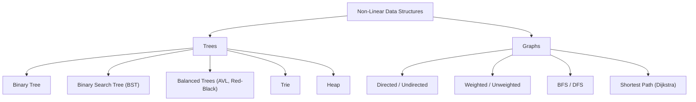

---

## 2. Trees

A **tree** is a hierarchical structure with a single **root** node, where every other node has exactly one parent and zero or more children, with no cycles.

**Key terms:** Root, Parent, Child, Leaf (no children), Height (longest path root→leaf), Depth (distance from root).

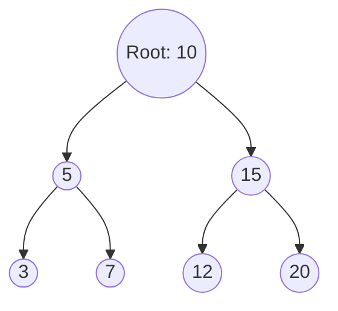

### 2.1 Binary Tree

A tree where each node has **at most two children** — commonly called `left` and `right`.

```swift
final class TreeNode<T> {
    var value: T
    var left: TreeNode<T>?
    var right: TreeNode<T>?

    init(_ value: T) {
        self.value = value
    }
}
```

### 2.2 Tree Traversals

Traversal = visiting every node in a defined order. Four common strategies:

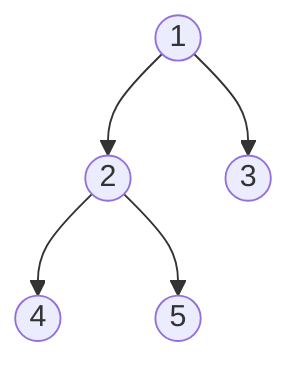

| Traversal | Order | Result for tree above |
|---|---|---|
| **Pre-order** | Root → Left → Right | 1, 2, 4, 5, 3 |
| **In-order** | Left → Root → Right | 4, 2, 5, 1, 3 |
| **Post-order** | Left → Right → Root | 4, 5, 2, 3, 1 |
| **Level-order (BFS)** | Level by level, top to bottom | 1, 2, 3, 4, 5 |

```swift
extension TreeNode {
    // Root -> Left -> Right
    func preOrder(_ visit: (T) -> Void) {
        visit(value)
        left?.preOrder(visit)
        right?.preOrder(visit)
    }

    // Left -> Root -> Right
    func inOrder(_ visit: (T) -> Void) {
        left?.inOrder(visit)
        visit(value)
        right?.inOrder(visit)
    }

    // Left -> Right -> Root
    func postOrder(_ visit: (T) -> Void) {
        left?.postOrder(visit)
        right?.postOrder(visit)
        visit(value)
    }
}

func levelOrder<T>(_ root: TreeNode<T>?) -> [T] {
    guard let root = root else { return [] }
    var result: [T] = []
    var queue: [TreeNode<T>] = [root]

    while !queue.isEmpty {
        let node = queue.removeFirst()
        result.append(node.value)
        if let l = node.left { queue.append(l) }
        if let r = node.right { queue.append(r) }
    }
    return result
}

// Example usage
let root = TreeNode(1)
root.left = TreeNode(2)
root.right = TreeNode(3)
root.left?.left = TreeNode(4)
root.left?.right = TreeNode(5)

var preOrderResult: [Int] = []
root.preOrder { preOrderResult.append($0) }
print(preOrderResult)          // [1, 2, 4, 5, 3]
print(levelOrder(root))        // [1, 2, 3, 4, 5]
```

**Time Complexity:** O(n) for any full traversal — every node is visited once. **Space:** O(h) for recursive traversals (h = tree height, due to call stack), O(n) worst case for level-order (queue can hold a full level).

---

### 2.3 Binary Search Tree (BST)

A binary tree where, for every node: **left subtree < node < right subtree**. This ordering enables fast search, insert, and delete.

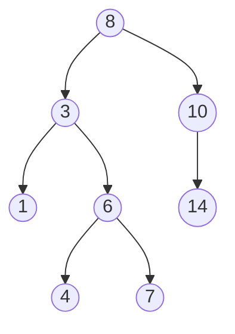

- **Average case (balanced):** Search/Insert/Delete → O(log n)
- **Worst case (degenerate, e.g. inserting sorted data):** O(n) — the tree becomes a linked list

```swift
final class BSTNode<T: Comparable> {
    var value: T
    var left: BSTNode<T>?
    var right: BSTNode<T>?

    init(_ value: T) {
        self.value = value
    }
}

final class BinarySearchTree<T: Comparable> {
    private(set) var root: BSTNode<T>?

    func insert(_ value: T) {
        root = insert(root, value)
    }

    private func insert(_ node: BSTNode<T>?, _ value: T) -> BSTNode<T> {
        guard let node = node else { return BSTNode(value) }

        if value < node.value {
            node.left = insert(node.left, value)
        } else if value > node.value {
            node.right = insert(node.right, value)
        }
        return node   // ignore duplicates
    }

    func contains(_ value: T) -> Bool {
        var current = root
        while let node = current {
            if value == node.value { return true }
            current = value < node.value ? node.left : node.right
        }
        return false
    }

    func remove(_ value: T) {
        root = remove(root, value)
    }

    private func remove(_ node: BSTNode<T>?, _ value: T) -> BSTNode<T>? {
        guard let node = node else { return nil }

        if value < node.value {
            node.left = remove(node.left, value)
        } else if value > node.value {
            node.right = remove(node.right, value)
        } else {
            // Found the node to delete
            if node.left == nil { return node.right }
            if node.right == nil { return node.left }

            // Two children: replace with in-order successor (smallest in right subtree)
            var successor = node.right!
            while let next = successor.left { successor = next }
            node.value = successor.value
            node.right = remove(node.right, successor.value)
        }
        return node
    }
}

// Example usage
let bst = BinarySearchTree<Int>()
[8, 3, 10, 1, 6, 14, 4, 7].forEach { bst.insert($0) }

print(bst.contains(6))   // true — O(log n) average
print(bst.contains(20))  // false
bst.remove(3)
print(bst.contains(3))   // false
```

---

### 2.4 Balanced Trees (AVL / Red-Black) — Why They Matter

A plain BST can degrade to O(n) if data is inserted in sorted order. **Self-balancing trees** automatically restructure themselves to guarantee O(log n) height.

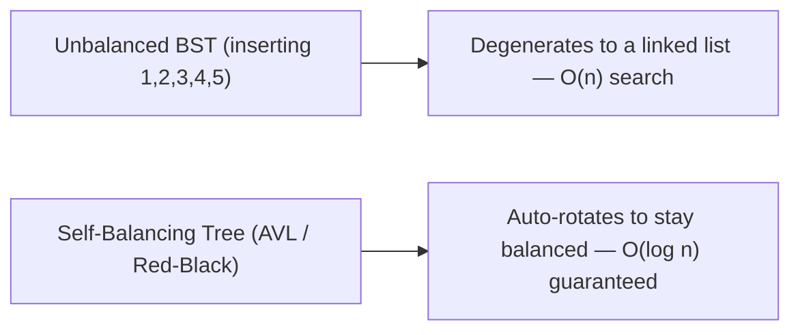

| Tree Type | Balancing Method | Used In |
|---|---|---|
| **AVL Tree** | Strict balance via rotations after every insert/delete | Read-heavy workloads |
| **Red-Black Tree** | Looser balance, fewer rotations | Swift's `Set`/`Dictionary` internals are hash-based, but Red-Black trees power things like C++'s `std::map`, Linux kernel schedulers |

> Implementing full AVL/Red-Black rotation logic is beyond this intro, but the key takeaway: **for guaranteed O(log n) performance regardless of insertion order, use a self-balancing tree** — or rely on Swift's `Dictionary`/`Set` (hash-based) when order doesn't matter.

---

### 2.5 Trie (Prefix Tree)

A tree specialized for storing strings, where each path from root to a node represents a prefix. Extremely efficient for autocomplete, spell-check, and prefix search.

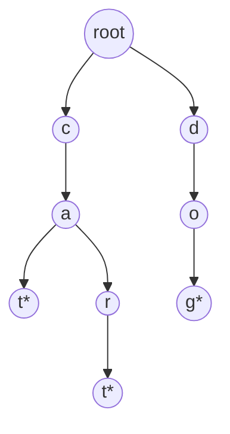
*(`*` marks the end of a valid word: "cat", "car", "dog")*

- **Search/Insert:** O(m) where m = length of the word (not the number of words stored!)

```swift
final class TrieNode {
    var children: [Character: TrieNode] = [:]
    var isEndOfWord = false
}

final class Trie {
    private let root = TrieNode()

    func insert(_ word: String) {
        var current = root
        for char in word {
            if current.children[char] == nil {
                current.children[char] = TrieNode()
            }
            current = current.children[char]!
        }
        current.isEndOfWord = true
    }

    func search(_ word: String) -> Bool {
        guard let node = findNode(word) else { return false }
        return node.isEndOfWord
    }

    func startsWith(_ prefix: String) -> Bool {
        findNode(prefix) != nil
    }

    private func findNode(_ str: String) -> TrieNode? {
        var current = root
        for char in str {
            guard let next = current.children[char] else { return nil }
            current = next
        }
        return current
    }
}

// Example usage
let trie = Trie()
["cat", "car", "dog"].forEach { trie.insert($0) }

print(trie.search("cat"))        // true
print(trie.search("ca"))         // false — "ca" isn't a complete word
print(trie.startsWith("ca"))     // true — prefix exists
print(trie.startsWith("do"))     // true
```

---

## 3. Graphs

A **graph** is a set of **vertices (nodes)** connected by **edges** — the most general way to represent relationships (social networks, maps, dependency chains, the web itself).

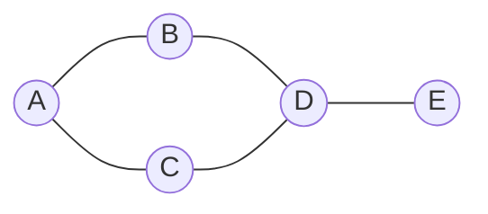

### 3.1 Types of Graphs

| Type | Description |
|---|---|
| **Undirected** | Edges have no direction (Facebook friendship) |
| **Directed (Digraph)** | Edges have direction (Twitter follows, A → B) |
| **Weighted** | Edges carry a cost/distance (road maps with distances) |
| **Unweighted** | All edges treated equally |
| **Cyclic** | Contains at least one cycle |
| **Acyclic (DAG)** | No cycles — e.g. task dependency graphs |

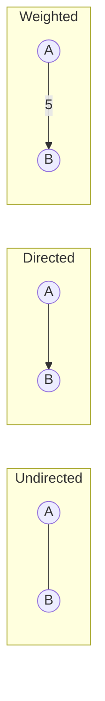

### 3.2 Representing a Graph

**Adjacency List** (most common — space-efficient for sparse graphs):

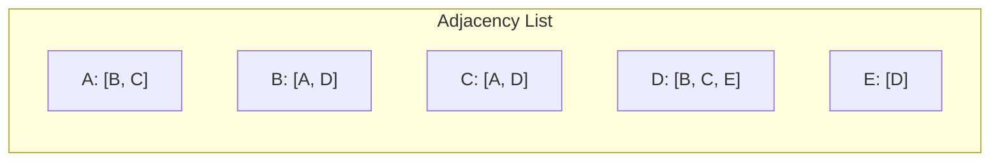

```swift
final class Graph<T: Hashable> {
    private var adjacencyList: [T: [T]] = [:]

    func addVertex(_ vertex: T) {
        if adjacencyList[vertex] == nil {
            adjacencyList[vertex] = []
        }
    }

    // Undirected edge — add both directions
    func addEdge(_ source: T, _ destination: T) {
        addVertex(source)
        addVertex(destination)
        adjacencyList[source]?.append(destination)
        adjacencyList[destination]?.append(source)
    }

    func neighbors(of vertex: T) -> [T] {
        adjacencyList[vertex] ?? []
    }
}

// Example usage
let graph = Graph<String>()
graph.addEdge("A", "B")
graph.addEdge("A", "C")
graph.addEdge("B", "D")
graph.addEdge("C", "D")
graph.addEdge("D", "E")

print(graph.neighbors(of: "D"))   // ["B", "C", "E"]
```

**Adjacency Matrix** (better for dense graphs, O(1) edge lookup, but O(v²) space):

```swift
struct AdjacencyMatrixGraph {
    private var matrix: [[Int]]
    let vertexCount: Int

    init(vertexCount: Int) {
        self.vertexCount = vertexCount
        self.matrix = Array(repeating: Array(repeating: 0, count: vertexCount), count: vertexCount)
    }

    mutating func addEdge(_ source: Int, _ destination: Int, weight: Int = 1) {
        matrix[source][destination] = weight
        matrix[destination][source] = weight   // omit this line for a directed graph
    }

    func hasEdge(_ source: Int, _ destination: Int) -> Bool {
        matrix[source][destination] != 0
    }
}
```

**Adjacency List vs Matrix**

| | Adjacency List | Adjacency Matrix |
|---|---|---|
| Space | O(V + E) | O(V²) |
| Edge lookup | O(degree of vertex) | O(1) |
| Best for | Sparse graphs | Dense graphs |
| Iterate all edges of a vertex | Fast | Slower (scan full row) |

---

### 3.3 Breadth-First Search (BFS)

Explores a graph **level by level**, visiting all neighbors before going deeper. Uses a **queue**.

- **Time:** O(V + E) &nbsp; **Space:** O(V)
- **Use cases:** shortest path in unweighted graphs, level-order traversal, finding connected components, social network "degrees of separation"

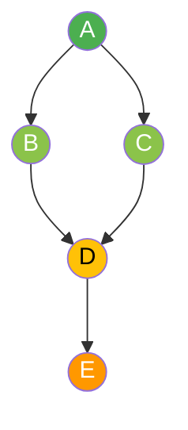
*BFS order from A: A (level 0) → B, C (level 1) → D (level 2) → E (level 3)*

```swift
func bfs<T: Hashable>(_ graph: Graph<T>, start: T) -> [T] {
    var visited: Set<T> = [start]
    var queue: [T] = [start]
    var result: [T] = []

    while !queue.isEmpty {
        let current = queue.removeFirst()   // O(n) with Array; use Deque for O(1) in production
        result.append(current)

        for neighbor in graph.neighbors(of: current) {
            if !visited.contains(neighbor) {
                visited.insert(neighbor)
                queue.append(neighbor)
            }
        }
    }
    return result
}

// Example usage
print(bfs(graph, start: "A"))   // ["A", "B", "C", "D", "E"]
```

> 💡 For production code, swap the `Array`-based queue for `Deque` from `swift-collections` (see Part 2) — `removeFirst()` on `Array` is O(n), while `Deque.removeFirst()` is O(1).

---

### 3.4 Depth-First Search (DFS)

Explores as **deep as possible** down one path before backtracking. Uses a **stack** (or recursion, which uses the call stack).

- **Time:** O(V + E) &nbsp; **Space:** O(V)
- **Use cases:** cycle detection, topological sort, maze solving, finding connected components, path existence

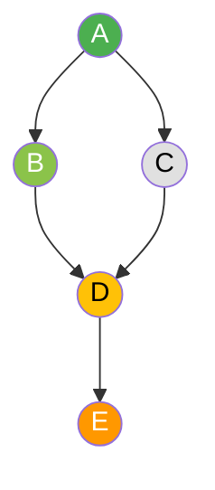
*DFS order from A: A → B → D → E → (backtrack) → C*

```swift
// Recursive DFS
func dfs<T: Hashable>(_ graph: Graph<T>, start: T) -> [T] {
    var visited: Set<T> = []
    var result: [T] = []

    func visit(_ vertex: T) {
        visited.insert(vertex)
        result.append(vertex)
        for neighbor in graph.neighbors(of: vertex) {
            if !visited.contains(neighbor) {
                visit(neighbor)
            }
        }
    }

    visit(start)
    return result
}

// Iterative DFS using an explicit stack
func dfsIterative<T: Hashable>(_ graph: Graph<T>, start: T) -> [T] {
    var visited: Set<T> = []
    var stack: [T] = [start]
    var result: [T] = []

    while let current = stack.popLast() {
        if visited.contains(current) { continue }
        visited.insert(current)
        result.append(current)

        for neighbor in graph.neighbors(of: current).reversed() {
            if !visited.contains(neighbor) {
                stack.append(neighbor)
            }
        }
    }
    return result
}

// Example usage
print(dfs(graph, start: "A"))   // ["A", "B", "D", "C", "E"]
```

**BFS vs DFS**

| | BFS | DFS |
|---|---|---|
| Data structure | Queue | Stack / Recursion |
| Explores | Level by level (wide) | Path by path (deep) |
| Shortest path (unweighted) | ✅ Guaranteed | ❌ Not guaranteed |
| Memory (wide, shallow graphs) | Higher | Lower |
| Memory (narrow, deep graphs) | Lower | Higher |
| Typical use | Shortest path, level order | Cycle detection, topological sort |

---

### 3.5 Dijkstra's Algorithm — Shortest Path (Weighted Graph)

Finds the shortest path from a source vertex to all other vertices in a graph with **non-negative** edge weights. Uses a **min-heap (priority queue)** — see `Heap` from Part 2.

- **Time:** O((V + E) log V) with a binary heap
- **Use cases:** GPS navigation, network routing, flight pricing

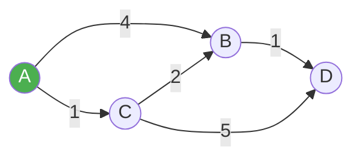
*Shortest path A→D: A→C (1) → C→B (2) → B→D (1) = **4**, cheaper than A→B (4) → B→D (1) = 5*

```swift
import HeapModule

struct WeightedGraph<T: Hashable> {
    private var adjacencyList: [T: [(neighbor: T, weight: Int)]] = [:]

    mutating func addEdge(_ source: T, _ destination: T, weight: Int) {
        adjacencyList[source, default: []].append((destination, weight))
        adjacencyList[destination, default: []].append((source, weight))  // omit for directed graph
    }

    func neighbors(of vertex: T) -> [(neighbor: T, weight: Int)] {
        adjacencyList[vertex] ?? []
    }
}

struct HeapEntry: Comparable {
    let vertex: String
    let distance: Int
    static func < (lhs: HeapEntry, rhs: HeapEntry) -> Bool { lhs.distance < rhs.distance }
    static func == (lhs: HeapEntry, rhs: HeapEntry) -> Bool { lhs.distance == rhs.distance }
}

func dijkstra(_ graph: WeightedGraph<String>, start: String) -> [String: Int] {
    var distances: [String: Int] = [start: 0]
    var heap = Heap<HeapEntry>()
    heap.insert(HeapEntry(vertex: start, distance: 0))

    while let current = heap.popMin() {
        // Skip stale entries (a shorter path was already found)
        if current.distance > (distances[current.vertex] ?? Int.max) { continue }

        for (neighbor, weight) in graph.neighbors(of: current.vertex) {
            let newDistance = current.distance + weight
            if newDistance < (distances[neighbor] ?? Int.max) {
                distances[neighbor] = newDistance
                heap.insert(HeapEntry(vertex: neighbor, distance: newDistance))
            }
        }
    }
    return distances
}

// Example usage
var wGraph = WeightedGraph<String>()
wGraph.addEdge("A", "B", weight: 4)
wGraph.addEdge("A", "C", weight: 1)
wGraph.addEdge("C", "B", weight: 2)
wGraph.addEdge("B", "D", weight: 1)
wGraph.addEdge("C", "D", weight: 5)

print(dijkstra(wGraph, start: "A"))
// ["A": 0, "C": 1, "B": 3, "D": 4]
```

---

## 4. Trees vs Graphs

| | Tree | Graph |
|---|---|---|
| Cycles | Never | Can have cycles |
| Root | Exactly one | No fixed root (usually) |
| Edges | n - 1 (for n nodes) | Any number |
| Parent-child | Strict hierarchy | Any connection pattern |
| Special case | A tree **is** a connected, acyclic graph | General structure |

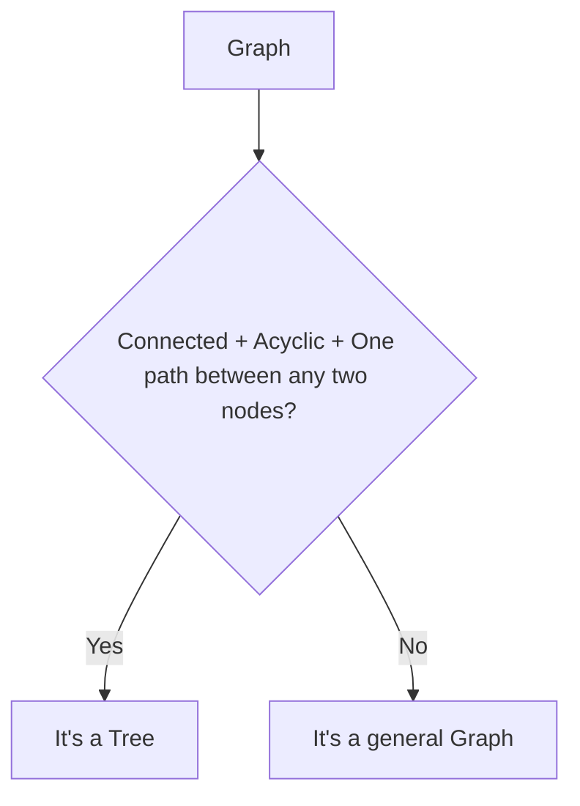

---

## 5. Recap

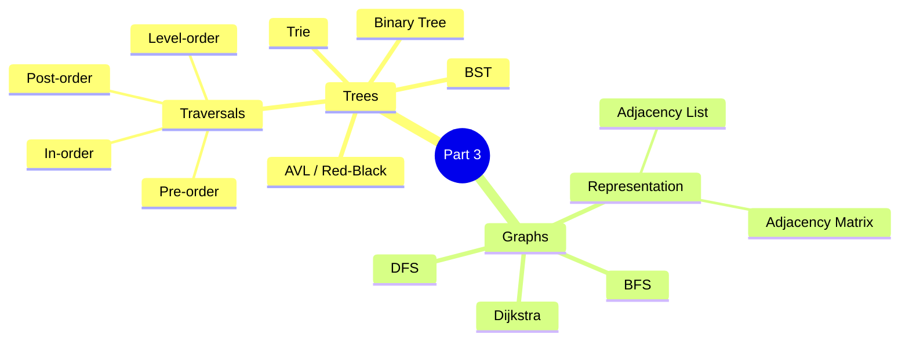

---

## 6. What's Next

**Part 4** can cover:

- **Dynamic Programming:** Memoization vs Tabulation, Fibonacci, Knapsack, Longest Common Subsequence, Coin Change
- **Greedy Algorithms:** Activity Selection, Huffman Coding, Minimum Spanning Tree (Kruskal's, Prim's)
- **Backtracking:** N-Queens, Sudoku Solver, Permutations/Combinations
- **String Algorithms:** KMP, Rabin-Karp pattern matching

---

*Document created for learning Data Structures & Algorithms using Swift — Part 3 of the series.*
