# Data Structures & Algorithms in Swift
### Part 4: Dynamic Programming, Greedy Algorithms, Backtracking & String Algorithms

> Continuing the series — **Part 1** (Searching & Sorting), **Part 2** (Linear Structures, Hashing & Swift Collections), **Part 3** (Trees & Graphs). This part covers **algorithmic problem-solving strategies** that show up constantly in interviews and real systems.

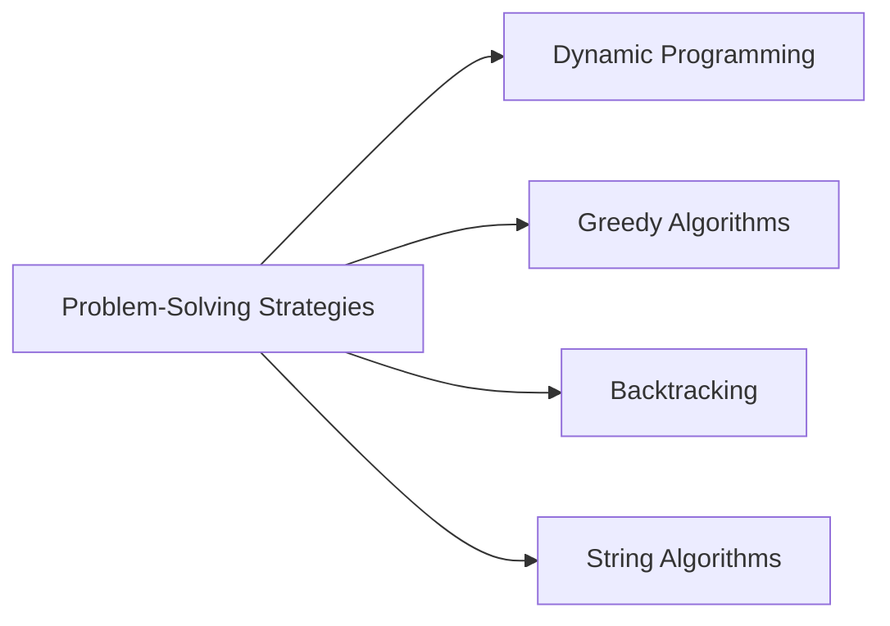

---

## 1. Dynamic Programming (DP)

**Dynamic Programming** solves complex problems by breaking them into overlapping subproblems, solving each subproblem once, and **storing the result** so it's never recomputed.

A problem is a good DP candidate when it has:

1. **Optimal Substructure** — the optimal solution can be built from optimal solutions to subproblems.
2. **Overlapping Subproblems** — the same subproblems are solved repeatedly in a naive recursive approach.

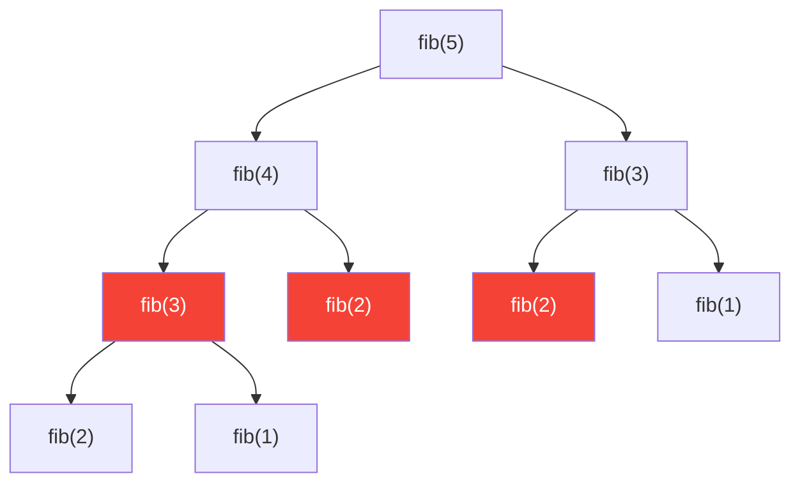
*Red nodes show repeated work — `fib(2)` and `fib(3)` are recomputed multiple times. DP eliminates this waste.*

### 1.1 Two DP Approaches

| Approach | How | Direction |
|---|---|---|
| **Memoization (Top-Down)** | Recursive + cache results | Start from the original problem, break down |
| **Tabulation (Bottom-Up)** | Iterative + build a table | Start from base cases, build up |

### 1.2 Example: Fibonacci

```swift
// ❌ Naive recursive — O(2ⁿ) time, tons of repeated work
func fibNaive(_ n: Int) -> Int {
    if n <= 1 { return n }
    return fibNaive(n - 1) + fibNaive(n - 2)
}

// ✅ Memoization (Top-Down) — O(n) time, O(n) space
func fibMemo(_ n: Int, _ cache: inout [Int: Int]) -> Int {
    if n <= 1 { return n }
    if let cached = cache[n] { return cached }

    let result = fibMemo(n - 1, &cache) + fibMemo(n - 2, &cache)
    cache[n] = result
    return result
}

// ✅ Tabulation (Bottom-Up) — O(n) time, O(1) space
func fibTabulation(_ n: Int) -> Int {
    if n <= 1 { return n }
    var prev = 0, curr = 1

    for _ in 2...n {
        let next = prev + curr
        prev = curr
        curr = next
    }
    return curr
}

// Example usage
var cache: [Int: Int] = [:]
print(fibMemo(10, &cache))      // 55
print(fibTabulation(10))        // 55
```

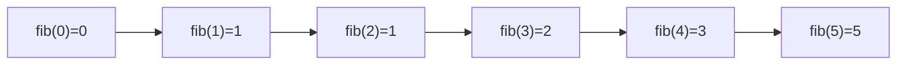

### 1.3 Example: 0/1 Knapsack

Given items with weights and values, and a knapsack of limited capacity, maximize the total value without exceeding capacity — each item can be used **at most once**.

- **Time:** O(n × capacity) &nbsp; **Space:** O(n × capacity)

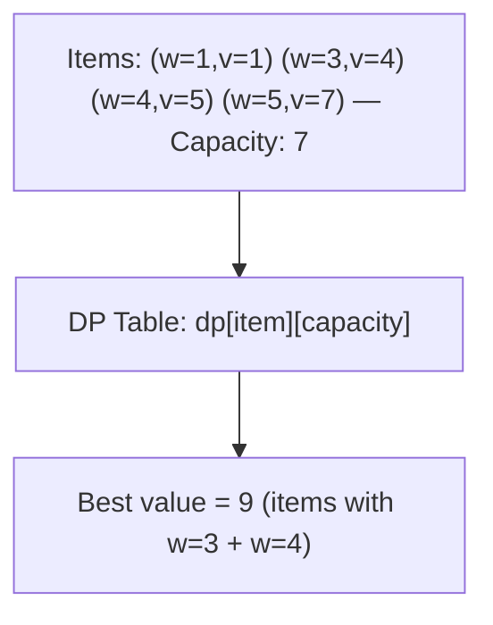

```swift
func knapsack(weights: [Int], values: [Int], capacity: Int) -> Int {
    let n = weights.count
    var dp = Array(repeating: Array(repeating: 0, count: capacity + 1), count: n + 1)

    for i in 1...n {
        for cap in 0...capacity {
            // Don't take item i-1
            dp[i][cap] = dp[i - 1][cap]

            // Take item i-1, if it fits
            if weights[i - 1] <= cap {
                let takeValue = dp[i - 1][cap - weights[i - 1]] + values[i - 1]
                dp[i][cap] = max(dp[i][cap], takeValue)
            }
        }
    }
    return dp[n][capacity]
}

// Example usage
let weights = [1, 3, 4, 5]
let values = [1, 4, 5, 7]
print(knapsack(weights: weights, values: values, capacity: 7))   // 9
```

### 1.4 Example: Longest Common Subsequence (LCS)

Find the length of the longest subsequence common to two strings (characters don't need to be contiguous).

- **Time:** O(m × n) &nbsp; **Space:** O(m × n)

```swift
func longestCommonSubsequence(_ text1: String, _ text2: String) -> Int {
    let chars1 = Array(text1)
    let chars2 = Array(text2)
    let m = chars1.count, n = chars2.count

    var dp = Array(repeating: Array(repeating: 0, count: n + 1), count: m + 1)

    for i in 1...m {
        for j in 1...n {
            if chars1[i - 1] == chars2[j - 1] {
                dp[i][j] = dp[i - 1][j - 1] + 1
            } else {
                dp[i][j] = max(dp[i - 1][j], dp[i][j - 1])
            }
        }
    }
    return dp[m][n]
}

// Example usage
print(longestCommonSubsequence("abcde", "ace"))   // 3 — "ace"
```

### 1.5 Example: Coin Change (Minimum Coins)

Find the fewest coins needed to make a target amount.

```swift
func coinChange(_ coins: [Int], _ amount: Int) -> Int {
    var dp = Array(repeating: Int.max, count: amount + 1)
    dp[0] = 0

    for total in 1...amount {
        for coin in coins where coin <= total {
            if dp[total - coin] != Int.max {
                dp[total] = min(dp[total], dp[total - coin] + 1)
            }
        }
    }
    return dp[amount] == Int.max ? -1 : dp[amount]
}

// Example usage
print(coinChange([1, 5, 10, 25], 30))   // 2 — one 25 + one 5
print(coinChange([2], 3))               // -1 — impossible
```

### 1.6 Common DP Problems Cheat Sheet

| Problem | Pattern |
|---|---|
| Fibonacci, Climbing Stairs | 1D DP, `dp[i] = dp[i-1] + dp[i-2]` |
| 0/1 Knapsack | 2D DP, include/exclude choice |
| LCS, Edit Distance | 2D DP over two strings |
| Coin Change | 1D DP, min/max over choices |
| Longest Increasing Subsequence | 1D DP, O(n²) or O(n log n) with binary search |

---

## 2. Greedy Algorithms

A **greedy algorithm** builds a solution step by step, always choosing the option that looks best **right now**, without reconsidering earlier choices. Fast and simple — but only produces the *globally* optimal answer for problems with the **greedy-choice property**.

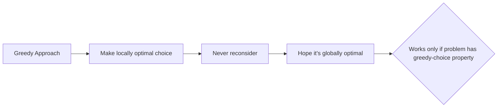

**Greedy vs DP:** DP explores all valid combinations and picks the best (guaranteed correct); Greedy commits to one path immediately (fast, but only correct for certain problem types).

### 2.1 Example: Activity Selection

Given activities with start/end times, select the **maximum number of non-overlapping activities**. Greedy strategy: always pick the activity that **finishes earliest**.

- **Time:** O(n log n) — dominated by the sort

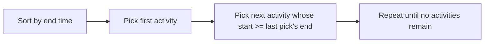

```swift
struct Activity {
    let start: Int
    let end: Int
}

func activitySelection(_ activities: [Activity]) -> [Activity] {
    let sorted = activities.sorted { $0.end < $1.end }
    var selected: [Activity] = []
    var lastEnd = Int.min

    for activity in sorted {
        if activity.start >= lastEnd {
            selected.append(activity)
            lastEnd = activity.end
        }
    }
    return selected
}

// Example usage
let activities = [
    Activity(start: 1, end: 4), Activity(start: 3, end: 5),
    Activity(start: 0, end: 6), Activity(start: 5, end: 7),
    Activity(start: 8, end: 9)
]
let result = activitySelection(activities)
print(result.map { "(\($0.start),\($0.end))" })
// [(1,4), (5,7), (8,9)]
```

### 2.2 Example: Coin Change — Greedy Version

For "nice" coin systems (like standard currency: 1, 5, 10, 25), greedy works and is faster than DP:

```swift
func greedyCoinChange(_ coins: [Int], _ amount: Int) -> [Int] {
    var remaining = amount
    var result: [Int] = []

    for coin in coins.sorted(by: >) {
        while remaining >= coin {
            result.append(coin)
            remaining -= coin
        }
    }
    return remaining == 0 ? result : []   // empty if it can't be made exactly
}

// Example usage
print(greedyCoinChange([25, 10, 5, 1], 63))
// [25, 25, 10, 1, 1, 1] — 6 coins, correct for this coin system
```

> ⚠️ **Careful:** Greedy coin change **fails** for arbitrary coin systems. Example: coins `[1, 3, 4]`, amount `6` → greedy picks `4 + 1 + 1` (3 coins), but the optimal is `3 + 3` (2 coins). This is exactly why the DP version from section 1.5 exists — it's always correct, greedy is not.

### 2.3 Huffman Coding (Concept)

Builds an optimal prefix-free binary encoding for compressing data — greedily merges the two **least frequent** nodes repeatedly using a min-heap (see `Heap` in Part 2), until one tree remains. Used in ZIP, JPEG, and MP3 compression.

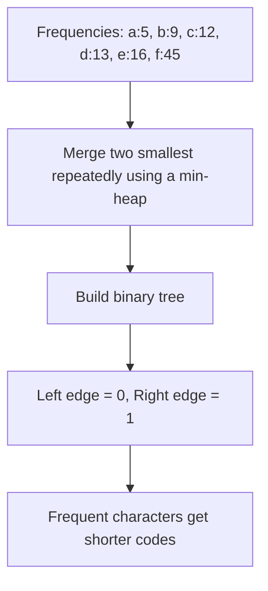

### 2.4 Minimum Spanning Tree — Prim's & Kruskal's (Concept)

Given a weighted, connected, undirected graph, find the subset of edges that connects all vertices with the **minimum total edge weight** and no cycles.

| Algorithm | Strategy | Uses |
|---|---|---|
| **Prim's** | Grow one tree from a starting vertex, always adding the cheapest edge to a new vertex | Min-Heap |
| **Kruskal's** | Sort all edges by weight, add them one by one, skipping any that would form a cycle | Union-Find (Disjoint Set) |

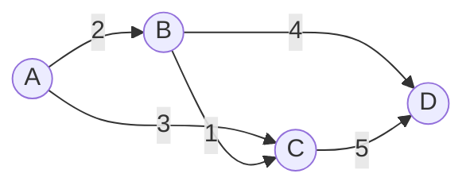
*MST here picks edges B-C(1), A-B(2), B-D(4) — total weight 7, connecting all vertices with minimum cost.*

### 2.5 When Does Greedy Work?

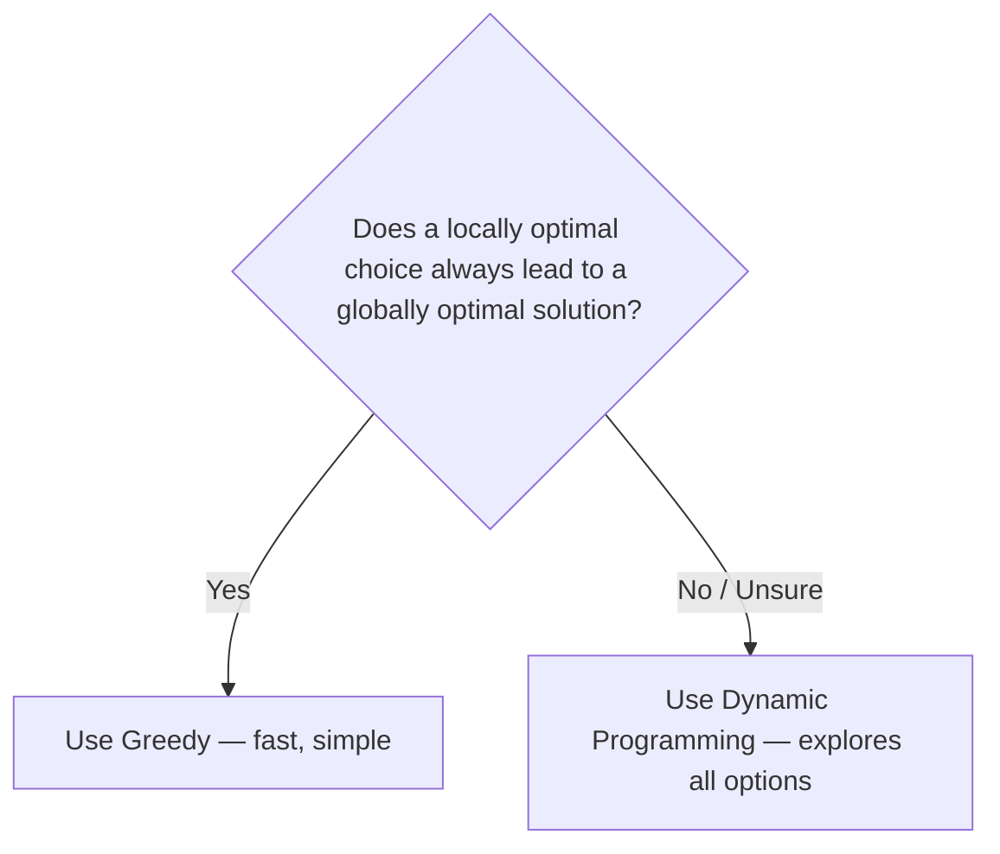

---

## 3. Backtracking

**Backtracking** explores all possible solutions by building candidates incrementally, and **abandoning ("pruning") a path as soon as it can't possibly lead to a valid solution** — instead of exploring it to the end.

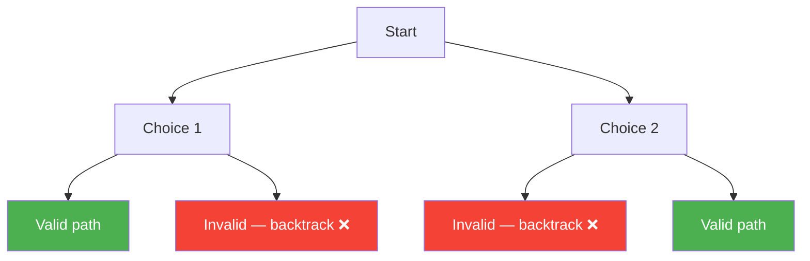

**Pattern:** `choose → explore → un-choose (backtrack)`

### 3.1 Example: Permutations

Generate all possible orderings of an array.

- **Time:** O(n × n!) &nbsp; **Space:** O(n) for recursion depth

```swift
func permutations<T>(_ array: [T]) -> [[T]] {
    var result: [[T]] = []
    var current: [T] = []
    var used = Array(repeating: false, count: array.count)

    func backtrack() {
        if current.count == array.count {
            result.append(current)
            return
        }

        for i in 0..<array.count {
            if used[i] { continue }

            // Choose
            used[i] = true
            current.append(array[i])

            // Explore
            backtrack()

            // Un-choose (backtrack)
            current.removeLast()
            used[i] = false
        }
    }

    backtrack()
    return result
}

// Example usage
print(permutations([1, 2, 3]))
// [[1,2,3],[1,3,2],[2,1,3],[2,3,1],[3,1,2],[3,2,1]]
```

### 3.2 Example: N-Queens

Place N queens on an N×N chessboard so that no two queens attack each other (same row, column, or diagonal).

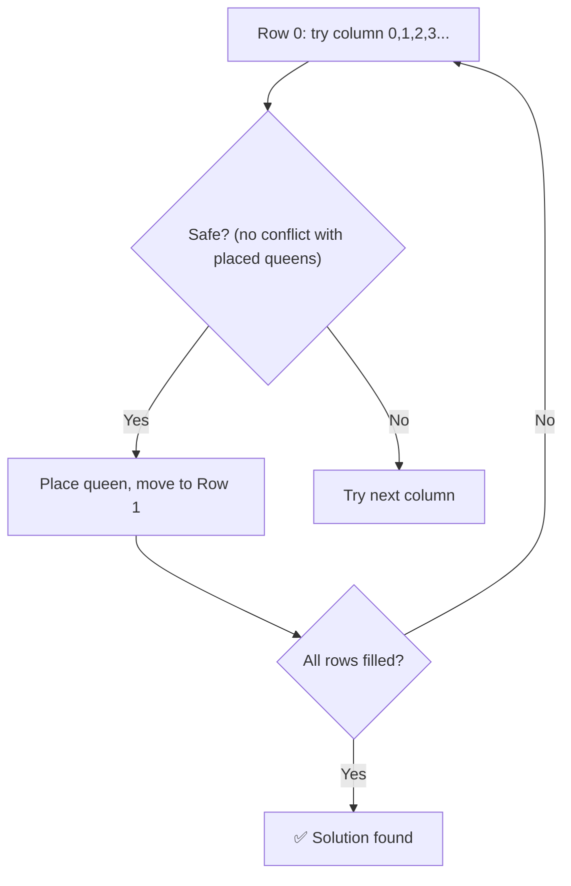

```swift
func solveNQueens(_ n: Int) -> [[Int]] {
    var solutions: [[Int]] = []
    var columns = Array(repeating: -1, count: n)   // columns[row] = column of queen in that row

    func isSafe(row: Int, col: Int) -> Bool {
        for prevRow in 0..<row {
            let prevCol = columns[prevRow]
            if prevCol == col { return false }                          // same column
            if abs(prevCol - col) == abs(prevRow - row) { return false } // same diagonal
        }
        return true
    }

    func backtrack(row: Int) {
        if row == n {
            solutions.append(columns)
            return
        }

        for col in 0..<n {
            if isSafe(row: row, col: col) {
                columns[row] = col          // choose
                backtrack(row: row + 1)     // explore
                columns[row] = -1           // un-choose (backtrack)
            }
        }
    }

    backtrack(row: 0)
    return solutions
}

// Example usage
let solutions = solveNQueens(4)
print("Number of solutions: \(solutions.count)")   // 2
print(solutions)
// [[1, 3, 0, 2], [2, 0, 3, 1]]  — each number = queen's column in that row
```

### 3.3 Example: Sudoku Solver (Concept)

Same choose/explore/un-choose pattern: find an empty cell, try digits 1–9, check row/column/3×3-box validity, recurse, and backtrack if no digit works.

```swift
func solveSudoku(_ board: inout [[Character]]) -> Bool {
    for row in 0..<9 {
        for col in 0..<9 {
            guard board[row][col] == "." else { continue }

            for digit in "123456789" {
                if isValidSudokuMove(board, row, col, digit) {
                    board[row][col] = digit         // choose
                    if solveSudoku(&board) { return true }  // explore
                    board[row][col] = "."           // un-choose (backtrack)
                }
            }
            return false   // no digit works — trigger backtrack in caller
        }
    }
    return true   // board fully filled
}

func isValidSudokuMove(_ board: [[Character]], _ row: Int, _ col: Int, _ digit: Character) -> Bool {
    for i in 0..<9 {
        if board[row][i] == digit || board[i][col] == digit { return false }
    }
    let boxRow = (row / 3) * 3, boxCol = (col / 3) * 3
    for r in boxRow..<boxRow + 3 {
        for c in boxCol..<boxCol + 3 {
            if board[r][c] == digit { return false }
        }
    }
    return true
}
```

### 3.4 Backtracking vs Brute Force

| | Brute Force | Backtracking |
|---|---|---|
| Explores | Every possible combination fully | Abandons invalid paths early (pruning) |
| Efficiency | Wasteful | Much faster in practice |
| Example | Try all N^N board placements | N-Queens with early conflict checks |

---

## 4. String Algorithms

Efficient pattern matching — finding occurrences of a "needle" string inside a "haystack" string — is a classic and very common problem (text editors, search engines, DNA sequencing, plagiarism detection).

### 4.1 Naive Pattern Matching (Baseline)

Check every possible starting position.

- **Time:** O(n × m) where n = text length, m = pattern length

```swift
func naiveSearch(text: String, pattern: String) -> [Int] {
    let t = Array(text)
    let p = Array(pattern)
    var matches: [Int] = []

    guard p.count <= t.count else { return matches }

    for i in 0...(t.count - p.count) {
        var matched = true
        for j in 0..<p.count {
            if t[i + j] != p[j] {
                matched = false
                break
            }
        }
        if matched { matches.append(i) }
    }
    return matches
}

// Example usage
print(naiveSearch(text: "abcabcabc", pattern: "abc"))   // [0, 3, 6]
```

### 4.2 KMP (Knuth-Morris-Pratt)

Avoids re-checking characters it already knows match by precomputing a **"failure function" (LPS array — Longest Proper Prefix which is also Suffix)** for the pattern, so on a mismatch it can skip ahead intelligently instead of restarting from scratch.

- **Time:** O(n + m) — a major improvement over naive O(n × m)

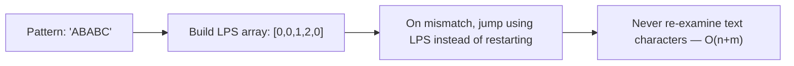

```swift
func computeLPS(_ pattern: [Character]) -> [Int] {
    var lps = Array(repeating: 0, count: pattern.count)
    var length = 0
    var i = 1

    while i < pattern.count {
        if pattern[i] == pattern[length] {
            length += 1
            lps[i] = length
            i += 1
        } else if length != 0 {
            length = lps[length - 1]
        } else {
            lps[i] = 0
            i += 1
        }
    }
    return lps
}

func kmpSearch(text: String, pattern: String) -> [Int] {
    let t = Array(text)
    let p = Array(pattern)
    guard !p.isEmpty else { return [] }

    let lps = computeLPS(p)
    var matches: [Int] = []
    var i = 0, j = 0   // i = text index, j = pattern index

    while i < t.count {
        if t[i] == p[j] {
            i += 1
            j += 1
            if j == p.count {
                matches.append(i - j)
                j = lps[j - 1]
            }
        } else if j != 0 {
            j = lps[j - 1]     // skip using precomputed table — no backtracking in text
        } else {
            i += 1
        }
    }
    return matches
}

// Example usage
print(kmpSearch(text: "abxabcabcaby", pattern: "abcaby"))   // [6]
```

### 4.3 Rabin-Karp

Uses **hashing** to find a pattern: compute a hash of the pattern, then slide across the text computing a **rolling hash** for each window — only doing a full character comparison when hashes match.

- **Average Time:** O(n + m) &nbsp; **Worst case:** O(n × m) (rare — hash collisions)
- **Great for:** searching for **multiple patterns** at once (compare multiple pattern hashes against one rolling hash pass)

```swift
func rabinKarpSearch(text: String, pattern: String) -> [Int] {
    let t = Array(text)
    let p = Array(pattern)
    let n = t.count, m = p.count
    guard m <= n, m > 0 else { return [] }

    let base = 256
    let prime = 101
    var matches: [Int] = []

    var patternHash = 0
    var windowHash = 0
    var highOrder = 1   // base^(m-1) % prime, used to remove the leading digit

    for _ in 0..<(m - 1) { highOrder = (highOrder * base) % prime }

    // Initial hashes for pattern and first window of text
    for i in 0..<m {
        patternHash = (base * patternHash + Int(p[i].asciiValue ?? 0)) % prime
        windowHash = (base * windowHash + Int(t[i].asciiValue ?? 0)) % prime
    }

    for i in 0...(n - m) {
        if patternHash == windowHash {
            // Hashes match — verify with actual character comparison (avoid collision false-positives)
            if Array(t[i..<i + m]) == p {
                matches.append(i)
            }
        }

        if i < n - m {
            windowHash = (base * (windowHash - Int(t[i].asciiValue ?? 0) * highOrder) + Int(t[i + m].asciiValue ?? 0)) % prime
            if windowHash < 0 { windowHash += prime }
        }
    }
    return matches
}

// Example usage
print(rabinKarpSearch(text: "abcabcabc", pattern: "abc"))   // [0, 3, 6]
```

### 4.4 String Algorithm Comparison

| Algorithm | Time (avg) | Time (worst) | Best For |
|---|---|---|---|
| Naive | O(n × m) | O(n × m) | Short strings, simplicity |
| KMP | O(n + m) | O(n + m) | Guaranteed linear time, single pattern |
| Rabin-Karp | O(n + m) | O(n × m) | Multiple pattern search, plagiarism detection |

---

## 5. Choosing a Strategy

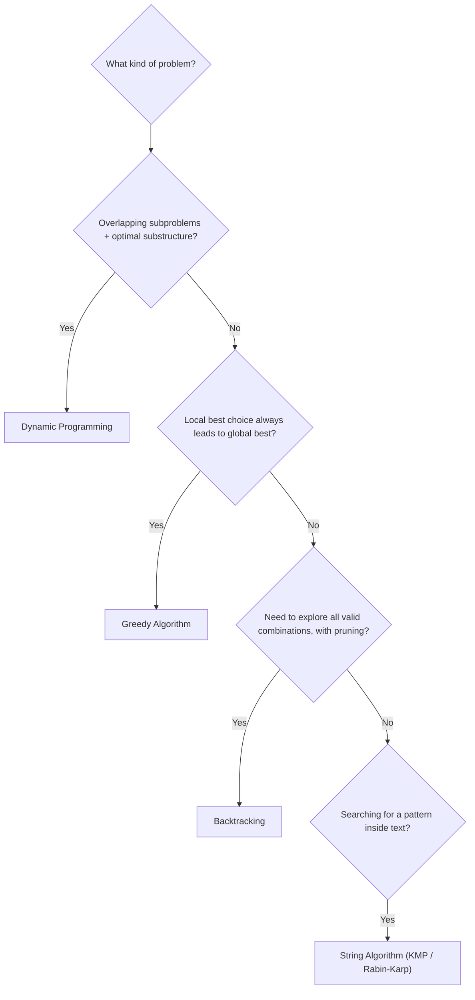

---

## 6. Recap

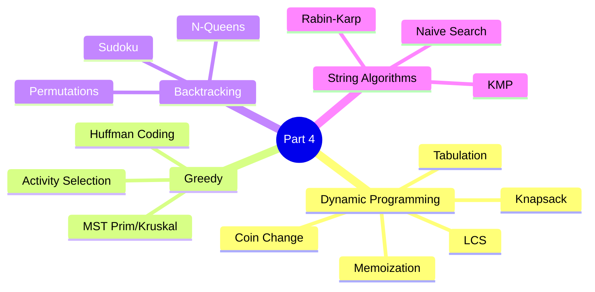

---

## 7. Series Complete — Full Recap

| Part | Topics |
|---|---|
| **Part 1** | Searching (Linear, Binary), Sorting (Bubble, Selection, Insertion, Merge, Quick) |
| **Part 2** | Array, Linked List, Stack, Queue, Hashing, Swift Collections (Deque, OrderedSet, Heap) |
| **Part 3** | Trees (Binary, BST, Trie), Graphs (BFS, DFS, Dijkstra) |
| **Part 4** | Dynamic Programming, Greedy Algorithms, Backtracking, String Algorithms |

With this, you have a solid, practical DSA foundation in Swift — covering nearly everything commonly tested in technical interviews and used in real-world engineering.

**Possible Part 5 topics**, if useful later: Union-Find (Disjoint Set), Bit Manipulation, Sliding Window & Two Pointers, Segment Trees / Fenwick Trees, System Design-adjacent structures (LRU Cache, Rate Limiters).

---

*Document created for learning Data Structures & Algorithms using Swift — Part 4 of the series.*
