# Data Structures & Algorithms in Swift
### Part 5: Union-Find, Bit Manipulation, Sliding Window/Two Pointers, Segment/Fenwick Trees & Practical Structures

> The final foundations part — completing **Part 1** (Searching & Sorting), **Part 2** (Linear Structures, Hashing & Swift Collections), **Part 3** (Trees & Graphs), **Part 4** (DP, Greedy, Backtracking, String Algorithms). This part rounds out the toolkit with patterns that show up constantly in interviews and real systems but didn't fit neatly into earlier parts.

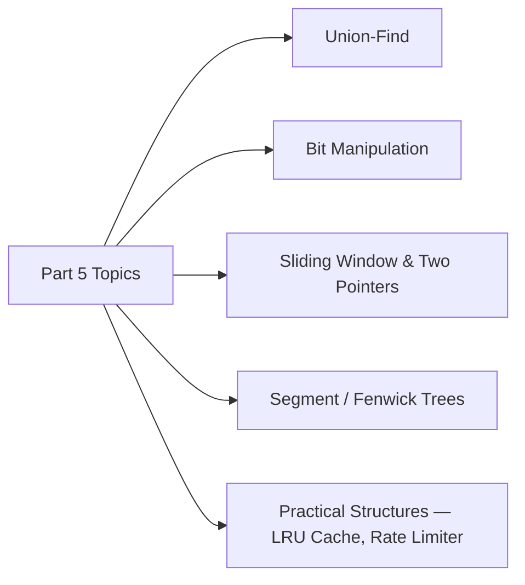

---

## 1. Union-Find (Disjoint Set Union)

**Union-Find** tracks a collection of elements split into non-overlapping ("disjoint") sets. It answers one question extremely fast: **"are these two elements in the same group?"**

- **Use cases:** Kruskal's MST (cycle detection), detecting cycles in undirected graphs, network connectivity, finding connected components, "accounts merge" style problems.

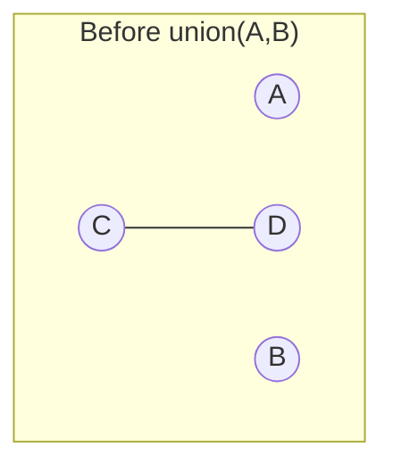
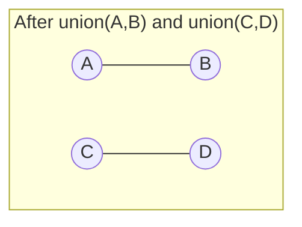

### 1.1 Two Key Optimizations

| Optimization | Idea | Effect |
|---|---|---|
| **Union by Rank/Size** | Always attach the smaller tree under the root of the larger tree | Keeps trees shallow |
| **Path Compression** | While finding a root, point every visited node directly to the root | Flattens the tree over time |

With both optimizations, operations run in **O(α(n))** — the inverse Ackermann function, which is effectively **O(1)** for any realistic input size.

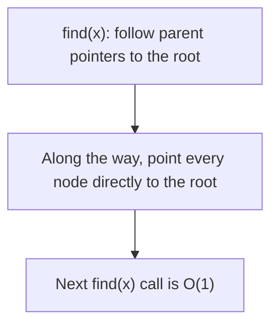

```swift
final class UnionFind {
    private var parent: [Int]
    private var rank: [Int]

    init(size: Int) {
        parent = Array(0..<size)          // each node starts as its own root
        rank = Array(repeating: 0, count: size)
    }

    // Path compression: flatten the tree while searching for the root
    func find(_ x: Int) -> Int {
        if parent[x] != x {
            parent[x] = find(parent[x])   // point directly to the root
        }
        return parent[x]
    }

    // Union by rank: attach smaller tree under the larger tree's root
    func union(_ x: Int, _ y: Int) {
        let rootX = find(x)
        let rootY = find(y)
        guard rootX != rootY else { return }   // already connected

        if rank[rootX] < rank[rootY] {
            parent[rootX] = rootY
        } else if rank[rootX] > rank[rootY] {
            parent[rootY] = rootX
        } else {
            parent[rootY] = rootX
            rank[rootX] += 1
        }
    }

    func connected(_ x: Int, _ y: Int) -> Bool {
        find(x) == find(y)
    }
}

// Example usage
let uf = UnionFind(size: 6)
uf.union(0, 1)
uf.union(1, 2)
uf.union(3, 4)

print(uf.connected(0, 2))   // true  — 0-1-2 merged
print(uf.connected(0, 3))   // false — different groups
print(uf.connected(3, 4))   // true
```

### 1.2 Example: Detecting a Cycle in an Undirected Graph

```swift
func hasCycle(edges: [(Int, Int)], vertexCount: Int) -> Bool {
    let uf = UnionFind(size: vertexCount)

    for (u, v) in edges {
        if uf.connected(u, v) {
            return true   // u and v already in the same set → adding this edge forms a cycle
        }
        uf.union(u, v)
    }
    return false
}

// Example usage
print(hasCycle(edges: [(0, 1), (1, 2), (2, 0)], vertexCount: 3))   // true — triangle
print(hasCycle(edges: [(0, 1), (1, 2), (2, 3)], vertexCount: 4))   // false — straight line
```

---

## 2. Bit Manipulation

Working directly with the binary representation of numbers. Operations are extremely fast (single CPU instructions) and useful for flags, sets, optimization tricks, and certain interview classics.

### 2.1 Core Operators in Swift

| Operator | Symbol | Example | Result |
|---|---|---|---|
| AND | `&` | `5 & 3` | `1` (0101 & 0011) |
| OR | `\|` | `5 \| 3` | `7` (0101 \| 0011) |
| XOR | `^` | `5 ^ 3` | `6` (0101 ^ 0011) |
| NOT | `~` | `~5` | `-6` (inverts all bits) |
| Left Shift | `<<` | `1 << 3` | `8` (multiply by 2³) |
| Right Shift | `>>` | `8 >> 2` | `2` (divide by 2²) |

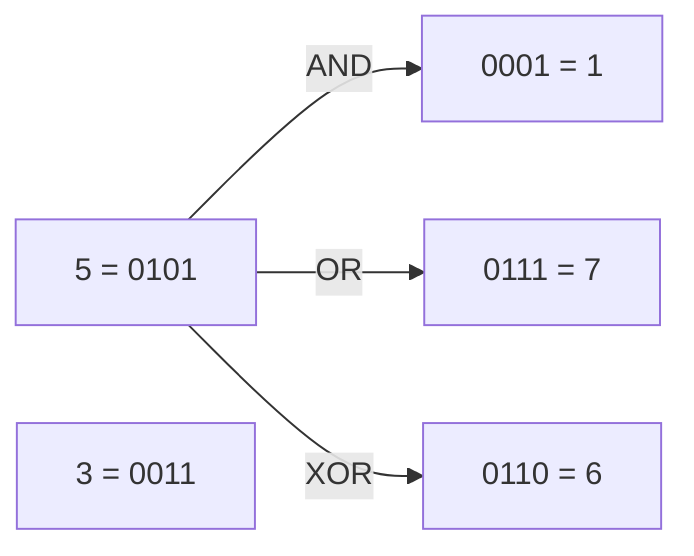

### 2.2 Common Bit Tricks

```swift
// Check if a number is even/odd — faster than % 2
func isEven(_ n: Int) -> Bool { n & 1 == 0 }

// Check if a number is a power of 2 — powers of 2 have exactly one bit set
func isPowerOfTwo(_ n: Int) -> Bool { n > 0 && (n & (n - 1)) == 0 }

// Count set bits (population count / Hamming weight)
func countSetBits(_ n: Int) -> Int {
    var count = 0
    var num = n
    while num != 0 {
        count += num & 1
        num >>= 1
    }
    return count
}

// Swift also provides this built-in:
let builtIn = (13).nonzeroBitCount   // 3  (13 = 1101)

// Get, set, and clear a specific bit
func getBit(_ n: Int, _ position: Int) -> Int { (n >> position) & 1 }
func setBit(_ n: Int, _ position: Int) -> Int { n | (1 << position) }
func clearBit(_ n: Int, _ position: Int) -> Int { n & ~(1 << position) }

// Example usage
print(isEven(10))            // true
print(isPowerOfTwo(16))      // true
print(isPowerOfTwo(18))      // false
print(countSetBits(13))      // 3  (13 = 1101)
print(getBit(13, 2))         // 1  (bit at position 2)
print(setBit(8, 1))          // 10 (1000 -> 1010)
```

### 2.3 Example: Single Number (XOR Trick)

Every element appears twice except one — find the unique one **in O(n) time, O(1) space**, using the fact that `x ^ x = 0` and `x ^ 0 = x`.

```swift
func singleNumber(_ nums: [Int]) -> Int {
    nums.reduce(0) { $0 ^ $1 }
}

// Example usage
print(singleNumber([4, 1, 2, 1, 2]))   // 4
// Walkthrough: 4^1=5, 5^2=7, 7^1=6, 6^2=4 — pairs cancel out, only 4 remains
```

### 2.4 Example: Using a Bitmask as a Compact Set

A bitmask represents a set of small integers (0..n) as bits in a single integer — extremely memory-efficient, common in DP-over-subsets problems (e.g. Traveling Salesman DP).

```swift
var visitedMask = 0

visitedMask |= (1 << 2)          // mark item 2 as visited
visitedMask |= (1 << 4)          // mark item 4 as visited

print((visitedMask & (1 << 2)) != 0)   // true — item 2 is visited
print((visitedMask & (1 << 3)) != 0)   // false — item 3 is not
```

---

## 3. Sliding Window & Two Pointers

Two closely related patterns for scanning arrays/strings **in O(n)** instead of the naive O(n²) nested-loop approach.

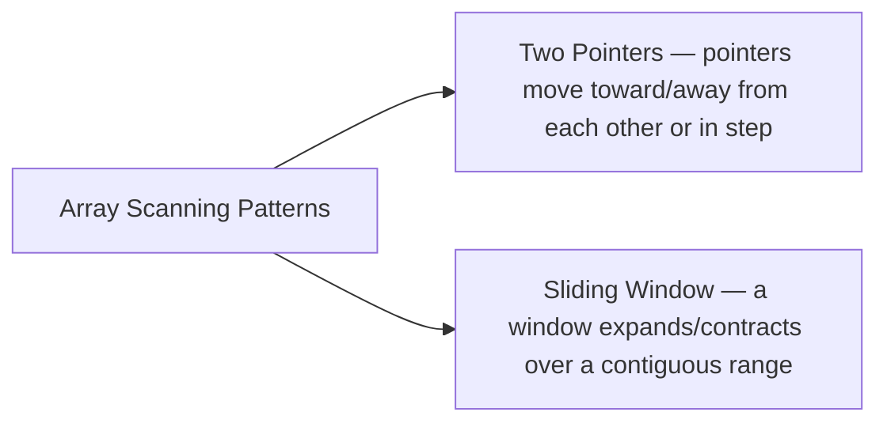

### 3.1 Two Pointers

Two indices move through the data — often starting at opposite ends and moving toward each other, or moving in the same direction at different speeds.

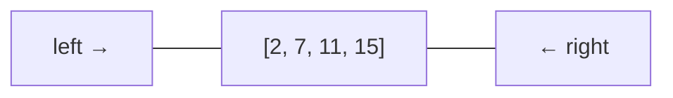

**Example: Two Sum on a Sorted Array**

```swift
func twoSumSorted(_ numbers: [Int], target: Int) -> [Int]? {
    var left = 0
    var right = numbers.count - 1

    while left < right {
        let sum = numbers[left] + numbers[right]
        if sum == target {
            return [left, right]
        } else if sum < target {
            left += 1     // need a bigger sum — move left pointer up
        } else {
            right -= 1    // need a smaller sum — move right pointer down
        }
    }
    return nil
}

// Example usage
print(twoSumSorted([2, 7, 11, 15], target: 18) ?? [])   // [1, 2] — 7 + 11
```

**Example: Reverse an Array In-Place**

```swift
func reverseInPlace<T>(_ array: inout [T]) {
    var left = 0
    var right = array.count - 1
    while left < right {
        array.swapAt(left, right)
        left += 1
        right -= 1
    }
}
```

**Example: Detect a Cycle in a Linked List (Floyd's Tortoise & Hare)**

Two pointers move at different **speeds** through the same structure.

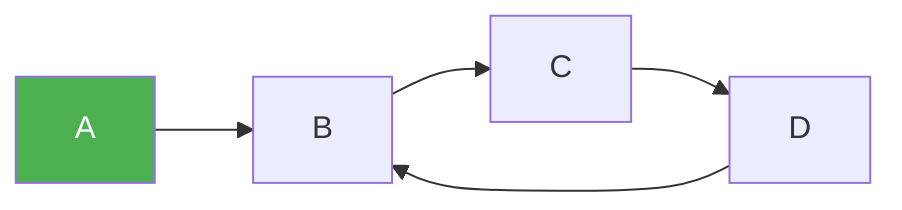

```swift
func hasCycle<T>(_ head: Node<T>?) -> Bool {
    var slow = head
    var fast = head

    while fast != nil && fast?.next != nil {
        slow = slow?.next               // moves 1 step
        fast = fast?.next?.next         // moves 2 steps
        if slow === fast { return true } // they meet → cycle exists
    }
    return false
}
```

### 3.2 Sliding Window

Maintains a **window** (subarray/substring) that expands and contracts as it scans across the data, avoiding recomputation from scratch at every position.

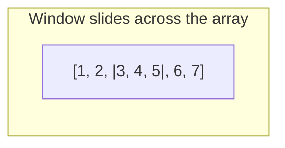

**Example: Maximum Sum Subarray of Size K (Fixed Window)**

```swift
func maxSumSubarray(_ nums: [Int], k: Int) -> Int {
    guard nums.count >= k else { return 0 }

    var windowSum = nums[0..<k].reduce(0, +)
    var maxSum = windowSum

    for i in k..<nums.count {
        windowSum += nums[i] - nums[i - k]   // add new element, remove the one leaving the window
        maxSum = max(maxSum, windowSum)
    }
    return maxSum
}

// Example usage
print(maxSumSubarray([2, 1, 5, 1, 3, 2], k: 3))   // 9 — [5, 1, 3]
```

**Example: Longest Substring Without Repeating Characters (Variable Window)**

```swift
func lengthOfLongestSubstring(_ s: String) -> Int {
    let chars = Array(s)
    var lastSeen: [Character: Int] = [:]
    var windowStart = 0
    var maxLength = 0

    for (windowEnd, char) in chars.enumerated() {
        if let seenIndex = lastSeen[char], seenIndex >= windowStart {
            windowStart = seenIndex + 1   // shrink window past the repeated character
        }
        lastSeen[char] = windowEnd
        maxLength = max(maxLength, windowEnd - windowStart + 1)
    }
    return maxLength
}

// Example usage
print(lengthOfLongestSubstring("abcabcbb"))   // 3 — "abc"
print(lengthOfLongestSubstring("pwwkew"))     // 3 — "wke"
```

### 3.3 When to Use Which

| Signal in the Problem | Pattern |
|---|---|
| "Subarray/substring of size K" | Fixed sliding window |
| "Longest/shortest subarray satisfying a condition" | Variable sliding window |
| "Pair/triplet that sums to X" in a **sorted** array | Two pointers (opposite ends) |
| "Detect a cycle" / "find the middle" of a linked list | Two pointers (different speeds) |
| Nested loop that only depends on a contiguous range | Almost always convertible to O(n) with one of these patterns |

---

## 4. Segment Trees & Fenwick Trees (Binary Indexed Trees)

Both structures answer **range queries** (sum, min, max over a range) and support **updates** — much faster than recomputing over the whole array each time.

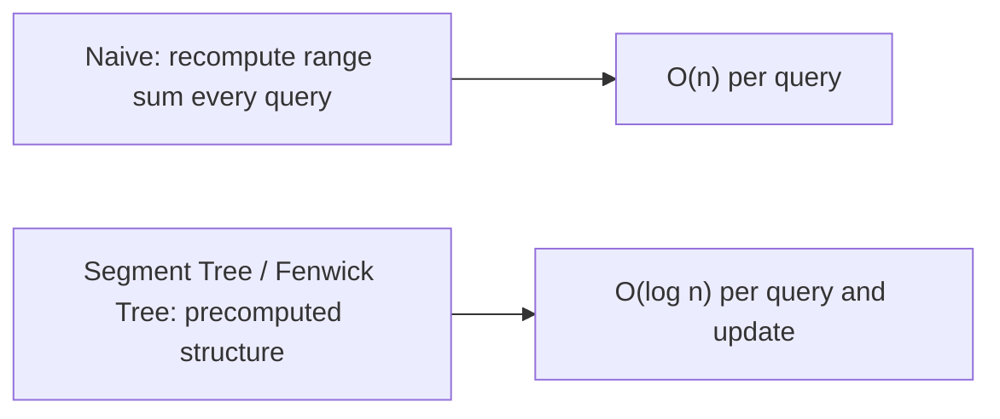

### 4.1 Segment Tree

A binary tree where each node represents the aggregate (e.g. sum) of a range of the array. Leaves are individual elements; each internal node combines its two children.

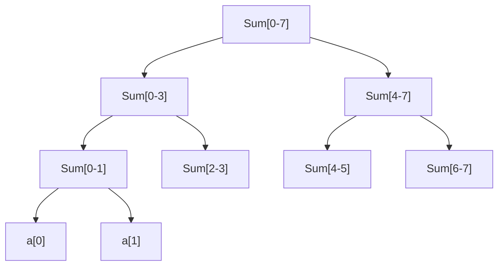

- **Build:** O(n) &nbsp; **Query:** O(log n) &nbsp; **Update:** O(log n)

```swift
final class SegmentTree {
    private var tree: [Int]
    private let n: Int

    init(_ array: [Int]) {
        n = array.count
        tree = Array(repeating: 0, count: 2 * n)
        for i in 0..<n { tree[n + i] = array[i] }
        for i in stride(from: n - 1, through: 1, by: -1) {
            tree[i] = tree[2 * i] + tree[2 * i + 1]
        }
    }

    // Point update: set array[index] = value — O(log n)
    func update(_ index: Int, _ value: Int) {
        var pos = index + n
        tree[pos] = value
        while pos > 1 {
            pos /= 2
            tree[pos] = tree[2 * pos] + tree[2 * pos + 1]
        }
    }

    // Range sum query over [left, right) — O(log n)
    func query(_ left: Int, _ right: Int) -> Int {
        var l = left + n, r = right + n
        var sum = 0
        while l < r {
            if l % 2 == 1 { sum += tree[l]; l += 1 }
            if r % 2 == 1 { r -= 1; sum += tree[r] }
            l /= 2
            r /= 2
        }
        return sum
    }
}

// Example usage
let segTree = SegmentTree([1, 3, 5, 7, 9, 11])
print(segTree.query(1, 4))     // 15 — sum of indices 1,2,3 (3+5+7)
segTree.update(1, 10)          // array becomes [1, 10, 5, 7, 9, 11]
print(segTree.query(1, 4))     // 22 — 10+5+7
```

### 4.2 Fenwick Tree (Binary Indexed Tree)

A more memory-compact alternative to segment trees for **prefix sums**, using clever bit manipulation (`i & -i` isolates the lowest set bit) instead of an explicit tree structure.

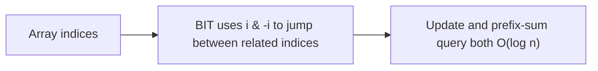

```swift
final class FenwickTree {
    private var tree: [Int]
    private let n: Int

    init(size: Int) {
        n = size
        tree = Array(repeating: 0, count: size + 1)
    }

    // Add `delta` to index i (0-based) — O(log n)
    func update(_ index: Int, _ delta: Int) {
        var i = index + 1
        while i <= n {
            tree[i] += delta
            i += i & (-i)   // move to the next index this position influences
        }
    }

    // Prefix sum of [0, index] (0-based, inclusive) — O(log n)
    func prefixSum(_ index: Int) -> Int {
        var i = index + 1
        var sum = 0
        while i > 0 {
            sum += tree[i]
            i -= i & (-i)   // move to the parent range
        }
        return sum
    }

    // Range sum [left, right] (0-based, inclusive)
    func rangeSum(_ left: Int, _ right: Int) -> Int {
        prefixSum(right) - (left > 0 ? prefixSum(left - 1) : 0)
    }
}

// Example usage
let fenwick = FenwickTree(size: 6)
[1, 3, 5, 7, 9, 11].enumerated().forEach { fenwick.update($0.offset, $0.element) }

print(fenwick.rangeSum(1, 3))   // 15 — 3+5+7
fenwick.update(1, 5)            // add 5 to index 1 (now 3+5=8 there)
print(fenwick.rangeSum(1, 3))   // 20 — 8+5+7
```

### 4.3 Segment Tree vs Fenwick Tree

| | Segment Tree | Fenwick Tree |
|---|---|---|
| Memory | ~2n–4n | n+1 |
| Supports | Sum, min, max, GCD, any associative op | Primarily sum/prefix-based operations |
| Code complexity | More code, more flexible | Compact, faster to write in an interview |
| Query/Update | O(log n) | O(log n) |

---

## 5. Practical, Interview-Favorite Structures

### 5.1 LRU Cache (Least Recently Used)

A fixed-capacity cache that evicts the **least recently used** item when full. Classic combination of a **Dictionary** (O(1) lookup) + a **Doubly Linked List** (O(1) reordering) — a very common real interview question.

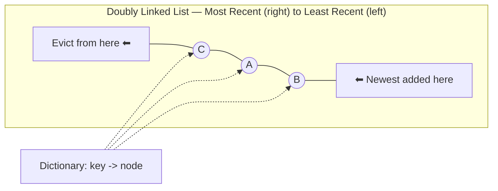

```swift
final class LRUNode<Key: Hashable, Value> {
    let key: Key
    var value: Value
    var prev: LRUNode?
    var next: LRUNode?

    init(key: Key, value: Value) {
        self.key = key
        self.value = value
    }
}

final class LRUCache<Key: Hashable, Value> {
    private let capacity: Int
    private var map: [Key: LRUNode<Key, Value>] = [:]
    private let head = LRUNode<Key, Value>(key: nil as! Key, value: nil as! Value)  // dummy head (most recent side)
    private let tail = LRUNode<Key, Value>(key: nil as! Key, value: nil as! Value)  // dummy tail (least recent side)

    init(capacity: Int) {
        self.capacity = capacity
        head.next = tail
        tail.prev = head
    }

    func get(_ key: Key) -> Value? {
        guard let node = map[key] else { return nil }
        moveToFront(node)          // just accessed — mark as most recently used
        return node.value
    }

    func put(_ key: Key, _ value: Value) {
        if let existing = map[key] {
            existing.value = value
            moveToFront(existing)
            return
        }

        let newNode = LRUNode(key: key, value: value)
        map[key] = newNode
        addToFront(newNode)

        if map.count > capacity {
            evictLeastRecentlyUsed()
        }
    }

    private func addToFront(_ node: LRUNode<Key, Value>) {
        node.next = head.next
        node.prev = head
        head.next?.prev = node
        head.next = node
    }

    private func remove(_ node: LRUNode<Key, Value>) {
        node.prev?.next = node.next
        node.next?.prev = node.prev
    }

    private func moveToFront(_ node: LRUNode<Key, Value>) {
        remove(node)
        addToFront(node)
    }

    private func evictLeastRecentlyUsed() {
        guard let lru = tail.prev, lru !== head else { return }
        remove(lru)
        map.removeValue(forKey: lru.key)
    }
}

// Note: the dummy head/tail sentinel trick above needs non-optional Key/Value,
// which requires force-casting nil — fine for a teaching example, but in production
// prefer Key/Value as optionals or a sentinel-free implementation.

// Example usage
let cache = LRUCache<Int, String>(capacity: 2)
cache.put(1, "A")
cache.put(2, "B")
print(cache.get(1) ?? "")   // "A" — 1 is now most recently used
cache.put(3, "C")           // capacity exceeded — evicts 2 (least recently used)
print(cache.get(2) ?? "nil")   // "nil" — evicted
```

**Complexity:** O(1) for both `get` and `put` — this efficiency is exactly why the Dictionary + Doubly-Linked-List combo is the standard answer.

### 5.2 Rate Limiter (Sliding Window Counter — Concept)

A common system-design-adjacent question: allow at most N requests per time window per user.

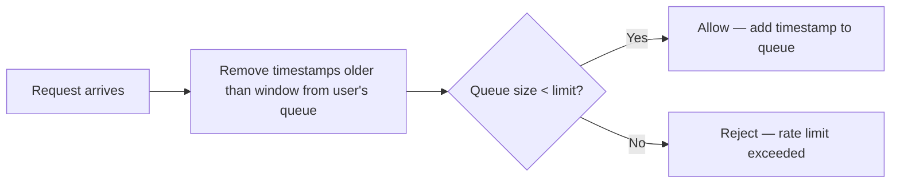

```swift
final class RateLimiter {
    private var requestLog: [String: [Double]] = [:]   // userId -> timestamps
    private let maxRequests: Int
    private let windowSeconds: Double

    init(maxRequests: Int, windowSeconds: Double) {
        self.maxRequests = maxRequests
        self.windowSeconds = windowSeconds
    }

    func allowRequest(userId: String, now: Double) -> Bool {
        var timestamps = requestLog[userId] ?? []
        timestamps.removeAll { now - $0 > windowSeconds }   // drop stale entries — sliding window

        if timestamps.count < maxRequests {
            timestamps.append(now)
            requestLog[userId] = timestamps
            return true
        }

        requestLog[userId] = timestamps
        return false
    }
}

// Example usage — allow 3 requests per 10-second window
let limiter = RateLimiter(maxRequests: 3, windowSeconds: 10)
print(limiter.allowRequest(userId: "u1", now: 0))    // true  (1st)
print(limiter.allowRequest(userId: "u1", now: 1))    // true  (2nd)
print(limiter.allowRequest(userId: "u1", now: 2))    // true  (3rd)
print(limiter.allowRequest(userId: "u1", now: 3))    // false — limit hit
print(limiter.allowRequest(userId: "u1", now: 11))   // true  — oldest timestamp (t=0) aged out
```

---

## 6. Choosing the Right Tool — Full-Series Cheat Sheet

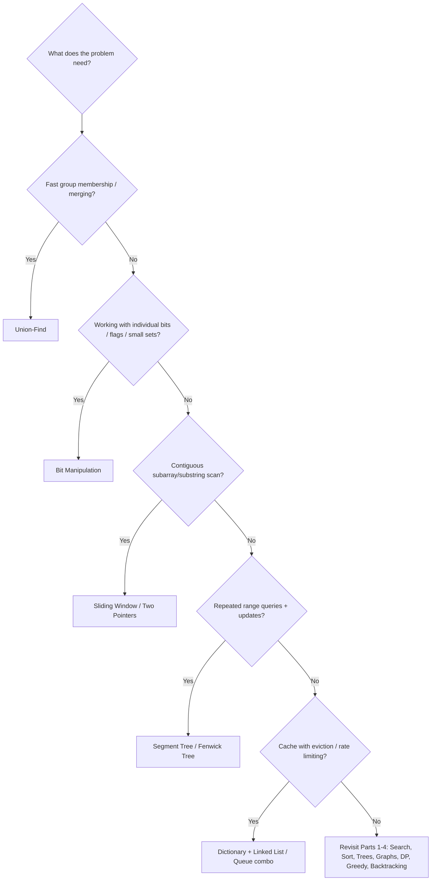

---

## 7. Recap

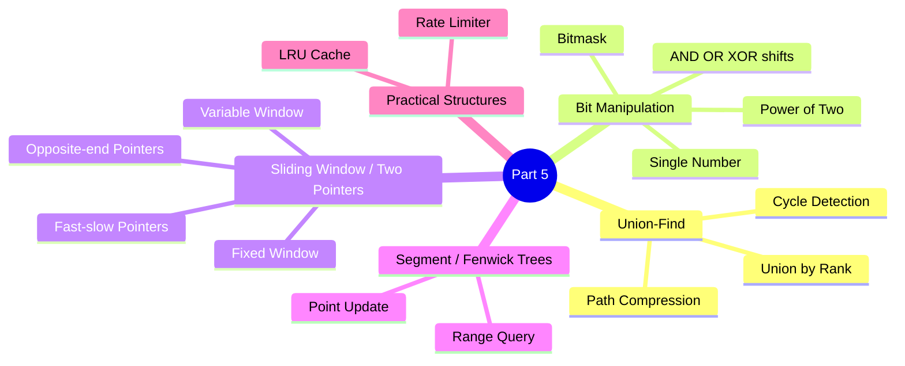

---

## 8. Full Series Summary

| Part | Topics |
|---|---|
| **Part 1** | Searching (Linear, Binary), Sorting (Bubble, Selection, Insertion, Merge, Quick) |
| **Part 2** | Array, Linked List, Stack, Queue, Hashing, Swift Collections (Deque, OrderedSet, Heap) |
| **Part 3** | Trees (Binary, BST, Trie), Graphs (BFS, DFS, Dijkstra) |
| **Part 4** | Dynamic Programming, Greedy Algorithms, Backtracking, String Algorithms |
| **Part 5** | Union-Find, Bit Manipulation, Sliding Window/Two Pointers, Segment/Fenwick Trees, LRU Cache, Rate Limiter |

This completes the foundational DSA-in-Swift series — from core concepts through the patterns that cover the large majority of real interview and engineering problems.

**Next up:** applying all of this to actual problems and questions — working through them one at a time, in Swift, using whichever structure or pattern from Parts 1–5 fits best.

---

*Document created for learning Data Structures & Algorithms using Swift — Part 5 of the series (final foundations part).*
