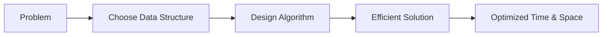
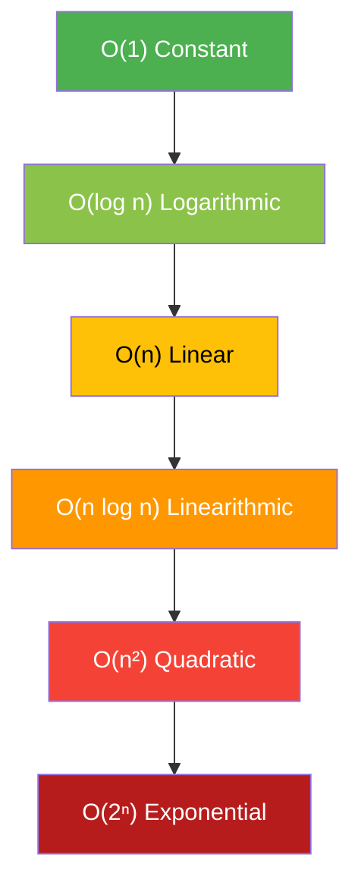

# Data Structures & Algorithms in Swift
### Part 1: Searching & Sorting

---

## 1. What is Data Structures and Algorithms (DSA)?

- **Data Structure** — a way of organizing and storing data so it can be accessed and modified efficiently (e.g. Array, Linked List, Stack, Queue, Tree, Graph, Hash Table).
- **Algorithm** — a step-by-step, well-defined procedure to solve a problem or perform a task (e.g. searching for a value, sorting a list, finding the shortest path).

Put simply:

> **Data Structure = How data is stored**
> **Algorithm = How data is processed**

They go hand-in-hand — the right algorithm often depends on the right data structure, and vice versa.

---

## 2. Why Do We Need DSA?

| Reason | Explanation |
|---|---|
| **Efficiency** | Well-chosen structures/algorithms turn slow, unscalable code into fast, scalable code. |
| **Problem Solving** | Almost every real-world engineering problem (search, ranking, routing, caching, recommendations) maps to a known DSA pattern. |
| **Resource Optimization** | Good DSA choices reduce memory usage and CPU cycles — critical on mobile devices (iOS apps!). |
| **Interviews** | Nearly every technical interview (FAANG, startups) tests DSA fundamentals. |
| **Scalability** | An app that works with 100 records may crash with 100 million — DSA knowledge prevents that. |
| **Better Code Design** | Understanding trade-offs (Array vs Set vs Dictionary) leads to cleaner, more idiomatic Swift code. |

**Example:** Searching a name in a phonebook of 1,000,000 contacts.
- Using **Linear Search** → up to 1,000,000 comparisons.
- Using **Binary Search** (on sorted data) → at most ~20 comparisons.

That difference is the entire point of studying DSA.

---

## 3. Time & Space Complexity (Big O Notation)

Big O describes how an algorithm's runtime or memory grows as input size (`n`) grows.

Best (fastest) → Worst (slowest): `O(1) < O(log n) < O(n) < O(n log n) < O(n²) < O(2ⁿ)`

---

## 4. Popular Algorithms (Overview)

| Category | Popular Algorithms |
|---|---|
| **Searching** | Linear Search, Binary Search, Jump Search, Interpolation Search |
| **Sorting** | Bubble Sort, Selection Sort, Insertion Sort, Merge Sort, Quick Sort, Heap Sort, Radix Sort |
| **Graph** | BFS, DFS, Dijkstra's, Bellman-Ford, A*, Kruskal's, Prim's |
| **Dynamic Programming** | Fibonacci, Knapsack, Longest Common Subsequence, Coin Change |
| **Greedy** | Activity Selection, Huffman Coding, Prim's/Kruskal's MST |
| **Divide & Conquer** | Merge Sort, Quick Sort, Binary Search, Karatsuba Multiplication |
| **Backtracking** | N-Queens, Sudoku Solver, Permutations |
| **String Matching** | KMP, Rabin-Karp, Boyer-Moore |
| **Hashing** | Hash Maps, Bloom Filters |
---

